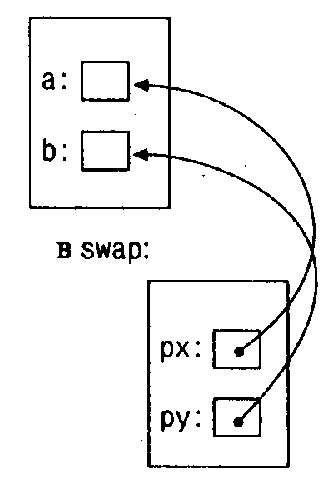
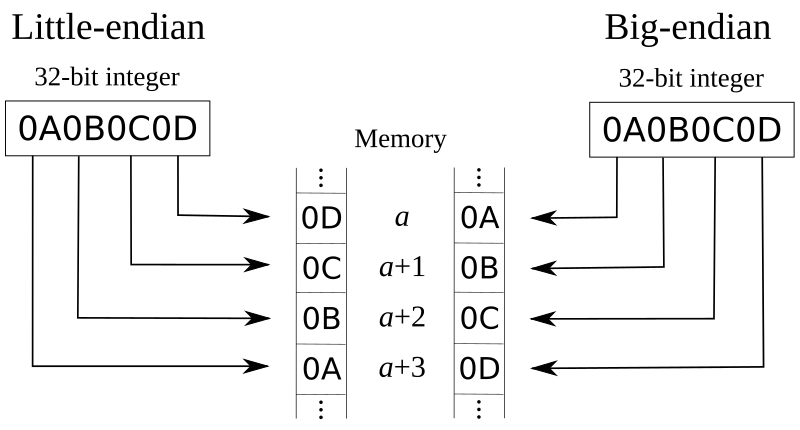

# Лекция 2. Указатели, массивы и строки

> Источник: [Google Slides](https://docs.google.com/presentation/d/1kZ238rxAW6KVKxkX4p2x0dyiPRsZRtL9_NEruCbfhcI/edit)

В этой лекции рассматриваются адреса памяти и работа с ними в C++. Мы разберём, как устроены указатели, почему массивы тесно связаны с адресной арифметикой, как представлены C-строки и как передавать функции через указатели.

После изучения материала вы сможете:

- получать адрес объекта и обращаться к значению по адресу;
- передавать объекты в функцию через указатели;
- различать нулевой указатель, `NULL` и `nullptr`;
- работать с массивами и C-строками;
- использовать `void*` и указатели на функции.

## 1. Указатели и адреса памяти

Указатель — это объект, который хранит адрес другой области памяти. Обычно тип указателя указывает, объект какого типа находится по этому адресу. Например, `int*` хранит адрес объекта типа `int`.

Специальное значение нулевого указателя означает, что указатель сейчас не связан ни с одним объектом.


На схеме переменная `a` хранит адрес переменной `b`. Сам адрес — такое же значение, которое занимает память и может быть присвоено другому указателю.

### Операторы `&` и `*`

Для базовой работы с указателями используются два унарных оператора:

- `&object` возвращает адрес объекта;
- `*pointer` разыменовывает указатель, то есть предоставляет доступ к объекту по хранящемуся адресу.

```cpp
int x = 1;
int y = 2;
int values[10];

int* pointer = &x;  // pointer хранит адрес x
y = *pointer;       // читаем x по адресу: y становится равен 1
*pointer = 0;       // изменяем x по адресу: x становится равен 0
pointer = &values[0];
```

Тип указателя важен: он определяет, как интерпретировать данные по адресу и на сколько байт сдвигаться при адресной арифметике.

> **Важно:** разыменовывать нулевой, неинициализированный или уже недействительный указатель нельзя. Это приводит к неопределённому поведению.

### Адрес самого указателя

Указатель тоже является объектом и имеет собственный адрес. Поэтому выражения `pointer` и `&pointer` обозначают разные значения:

```cpp
#include <iostream>

int main() {
    int value = 10;
    int* pointer = &value;

    std::cout << "Адрес value: " << &value << '\n';
    std::cout << "Значение pointer: " << pointer << '\n';
    std::cout << "Адрес pointer: " << &pointer << '\n';
}
```

Первые два адреса будут одинаковыми: `pointer` указывает на `value`. Третий адрес относится к ячейке, в которой хранится сам указатель.

### Размер указателя

Размер объекта зависит от его типа, но размер указателя обычно определяется архитектурой процесса. Поэтому `bool*` и `long*` в одной программе, как правило, имеют одинаковый размер:

```cpp
#include <iostream>

int main() {
    bool flag = true;
    long number = 128L;

    bool* flag_pointer = &flag;
    long* number_pointer = &number;

    std::cout << sizeof(flag) << ' ' << sizeof(number) << '\n';
    std::cout << sizeof(flag_pointer) << ' ' << sizeof(number_pointer) << '\n';
}
```

На распространённой 64-битной платформе оба указателя обычно занимают 8 байт. Стандарт C++ не фиксирует это значение, поэтому полагаться на конкретный размер без проверки не следует.

### Указатели на указатели

Если объектом по адресу является другой указатель, появляется дополнительный уровень косвенного доступа:

```cpp
#include <iostream>

int main() {
    int value = 0;
    int* pointer = &value;
    int** pointer_to_pointer = &pointer;
    int*** third_level = &pointer_to_pointer;

    std::cout << value << '\n';
    std::cout << *pointer << '\n';
    std::cout << **pointer_to_pointer << '\n';
    std::cout << ***third_level << '\n';
}
```

Во всех четырёх случаях читается один объект `value`. Каждая звёздочка снимает один уровень указателя.

### Нулевой указатель: `nullptr`, `0` и `NULL`

В современном C++ для нулевого указателя следует использовать `nullptr`. Это отдельный литерал типа `std::nullptr_t`, который не смешивается с целыми числами при выборе перегруженной функции.

```cpp
#include <cstddef>
#include <iostream>

void Print(int*) {
    std::cout << "Print(int*)\n";
}

void Print(int) {
    std::cout << "Print(int)\n";
}

int main() {
    Print(nullptr);  // Print(int*)
    Print(0);        // Print(int)

    // Print(NULL);  // Может быть неоднозначно: NULL обычно является макросом.
}
```

`NULL` исторически использовался в C и старом C++, но чаще всего раскрывается в целочисленную константу. В новом коде предпочтителен `nullptr`.

## 2. Передача объектов через указатели

Аргументы функции по умолчанию передаются по значению. Функция получает копии и не может таким способом изменить исходные переменные:

```cpp
void SwapValues(int left, int right) {
    int temporary = left;
    left = right;
    right = temporary;
}
```

Чтобы изменить объекты вызывающего кода, можно передать их адреса:

```cpp
#include <iostream>

void Swap(int* left, int* right) {
    int temporary = *left;
    *left = *right;
    *right = temporary;
}

int main() {
    int first = 1;
    int second = 2;

    Swap(&first, &second);
    std::cout << first << ' ' << second << '\n';  // 2 1
}
```



Параметры `left` и `right` хранят адреса исходных переменных. Оператор `*` позволяет функции изменить значения непосредственно по этим адресам.

В современном C++ для обязательных изменяемых параметров часто удобнее ссылки. Указатель полезен, когда отсутствие объекта допустимо и может быть выражено значением `nullptr`.

## 3. Массивы и адресная арифметика

Массив — это последовательность элементов одного типа, расположенных в памяти подряд. Размер встроенного массива задаётся при создании и не меняется. Индексация начинается с нуля.

```cpp
#include <iostream>

int main() {
    int uninitialized[10];
    int inferred[] = {1, 2, 3, 4, 5};
    int fixed[3] = {1, 2, 3};

    int matrix[2][3] = {
        {1, 2, 3},
        {4, 5, 6},
    };

    std::cout << inferred[0] << '\n';
    std::cout << matrix[1][2] << '\n';
}
```


### Преобразование массива в указатель

В большинстве выражений имя массива преобразуется в указатель на первый элемент:

```cpp
int values[10];

int* first = &values[0];
int* same_first = values;
```

Оба указателя содержат один адрес. Значение первого элемента можно получить несколькими эквивалентными способами:

```cpp
int value1 = values[0];
int value2 = *values;
int value3 = *first;
```

> **Важно:** массив и указатель — разные типы объектов. Массив хранит все свои элементы, а указатель хранит только адрес. Преобразование массива в указатель происходит лишь в определённых выражениях.

### Арифметика указателей

При прибавлении единицы указатель перемещается к следующему объекту своего типа, а не просто к следующему байту:

```cpp
int values[] = {10, 20, 30};

int* pointer = values;

int first = *pointer;         // 10
int second = *(pointer + 1);  // 20
int third = pointer[2];       // 30
```


Для допустимого индекса `i` выражения `values[i]`, `*(values + i)`, `pointer[i]` и `*(pointer + i)` эквивалентны.

Арифметика указателей определена только внутри одного массива и для позиции сразу после его последнего элемента. Разыменовывать позицию после массива нельзя.

## 4. C-строки

C-строка — это массив символов, завершённый нулевым символом `'\0'`. Этот символ позволяет функциям определить, где заканчивается строка.


Строковый литерал в C++ имеет тип массива константных символов. Поэтому указатель на литерал должен быть `const char*`:

```cpp
const char* first = "Hello world";
char second[] = "Hello world";
const char* third = second;
```

`first` указывает на строковый литерал, который нельзя изменять. `second` является отдельным изменяемым массивом, куда символы литерала были скопированы.

### Длина строки

Длину C-строки можно найти, перемещая указатель до нулевого символа:

```cpp
#include <cstddef>

std::size_t StringLength(const char* string) {
    std::size_t length = 0;

    while (*string != '\0') {
        ++string;
        ++length;
    }

    return length;
}
```

Функция предполагает, что ей передан корректный ненулевой указатель на строку, содержащую завершающий символ `'\0'`.

### Сравнение строк

Строки сравниваются посимвольно. Сравнивать сами указатели оператором `==` недостаточно: он проверит адреса, а не содержимое.

Вариант с индексами:

```cpp
int StringCompare(const char* first, const char* second) {
    std::size_t index = 0;

    while (first[index] != '\0' && second[index] != '\0') {
        if (first[index] != second[index]) {
            return first[index] < second[index] ? -1 : 1;
        }
        ++index;
    }

    if (first[index] == second[index]) return 0;
    return first[index] < second[index] ? -1 : 1;
}
```

Ту же операцию можно выразить через арифметику указателей:

```cpp
int StringCompare(const char* first, const char* second) {
    while (*first != '\0' && *first == *second) {
        ++first;
        ++second;
    }

    return static_cast<unsigned char>(*first) - static_cast<unsigned char>(*second);
}
```

Обе реализации возвращают ноль для равных строк, отрицательное значение, если первая строка должна идти раньше, и положительное — в обратном случае.

### Аргументы командной строки

В традиционной форме `main` получает количество аргументов и массив указателей на строки:

```cpp
#include <iostream>

int main(int argc, char* argv[]) {
    for (int index = 0; index < argc; ++index) {
        std::cout << argv[index] << '\n';
    }
}
```

`argc` содержит количество аргументов, а `argv[index]` указывает на C-строку с соответствующим аргументом.

## 5. Универсальный указатель `void*`

Указатель `void*` может хранить адрес объекта любого типа. Информация о типе объекта при этом теряется, поэтому разыменовать `void*` напрямую нельзя.

```cpp
int value = 239;
int* typed_pointer = &value;

void* untyped_pointer = typed_pointer;
int* restored_pointer = static_cast<int*>(untyped_pointer);
```

Адрес при преобразовании не меняется. Меняется только информация, которую компилятор использует для интерпретации данных.

> **Важно:** программист обязан восстановить правильный тип. Приведение к несовместимому типу с последующим чтением может привести к неопределённому поведению.

### Просмотр объекта как последовательности байтов

Любой объект можно исследовать как последовательность байтов. Для этого удобно привести адрес к указателю на `std::uint8_t`:

```cpp
#include <cstddef>
#include <cstdint>
#include <format>
#include <iostream>

void PrintBytes(const void* object, std::size_t size) {
    const auto* bytes = static_cast<const std::uint8_t*>(object);

    for (std::size_t index = 0; index < size; ++index) {
        std::cout << std::format("{:08b} ", bytes[index]);
    }

    std::cout << '\n';
}
```

Функция `std::format` появилась в C++20. Прибавление единицы к `bytes` или увеличение индекса перемещает чтение на один байт.

```cpp
int main() {
    int value = 2 << 10;
    PrintBytes(&value, sizeof(value));

    value = 239;
    PrintBytes(&value, sizeof(value));
}
```

Порядок байтов многобайтового числа зависит от платформы. На little-endian системах младший байт хранится по младшему адресу, а на big-endian — наоборот.



## 6. Указатели на функции

Адрес можно получить не только у объекта, но и у функции. Тип указателя содержит тип возвращаемого значения и типы параметров:

```cpp
int Same(int value) {
    return value;
}

int main() {
    int (*function)(int) = Same;
    int (*same_function)(int) = &Same;

    function(2);
    same_function(2);
}
```

Амперсанд при присваивании адреса функции необязателен: `Same` и `&Same` дают подходящий указатель.

Указатель на функцию можно передать как стратегию поведения. Следующая функция выбирает элемент массива согласно переданному отношению порядка:

```cpp
#include <cstddef>

int* FindByOrder(int* array, std::size_t size, bool (*comes_before)(int, int)) {
    if (size == 0) return nullptr;

    int* result = array;

    for (std::size_t index = 1; index < size; ++index) {
        if (comes_before(*result, array[index])) {
            result = &array[index];
        }
    }

    return result;
}
```

Две функции с подходящей сигнатурой задают разные варианты сравнения:

```cpp
bool Less(int left, int right) {
    return left < right;
}

bool Greater(int left, int right) {
    return left > right;
}
```

Использование:

```cpp
#include <iostream>

int main() {
    int values[] = {1, 2, 3, 4, 5, 6, 7, 8};

    std::cout << *FindByOrder(values, 8, Less) << '\n';     // 8
    std::cout << *FindByOrder(values, 8, Greater) << '\n';  // 1
}
```

В современном C++ вместо обычного указателя на функцию также применяют функциональные объекты, лямбда-выражения и `std::function`.

## Итоги

- Указатель хранит адрес объекта, а оператор `*` предоставляет доступ к объекту по адресу.
- Для нулевого указателя в современном C++ используется `nullptr`.
- Передача адреса позволяет функции изменить объект вызывающего кода.
- Элементы массива размещаются последовательно, поэтому к ним можно обращаться через адресную арифметику.
- C-строка заканчивается символом `'\0'`.
- `void*` хранит адрес без информации о типе.
- Указатели на функции позволяют передавать алгоритму поведение.

## Вопросы для самопроверки

1. Чем отличаются значения `pointer`, `*pointer` и `&pointer`?
2. Почему `nullptr` предпочтительнее `NULL`?
3. Почему массив нельзя считать обычным указателем, несмотря на автоматическое преобразование?
4. Что произойдёт при прибавлении единицы к `int*`?
5. Почему строковые литералы следует хранить через `const char*`?
6. Почему `void*` нельзя разыменовать без приведения типа?
7. Из каких частей состоит тип указателя на функцию?
