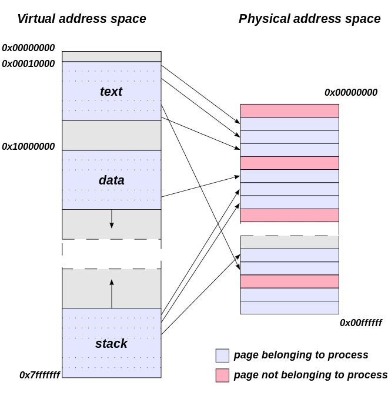
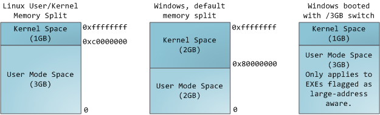
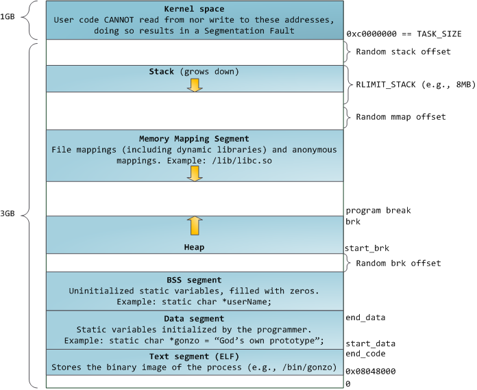
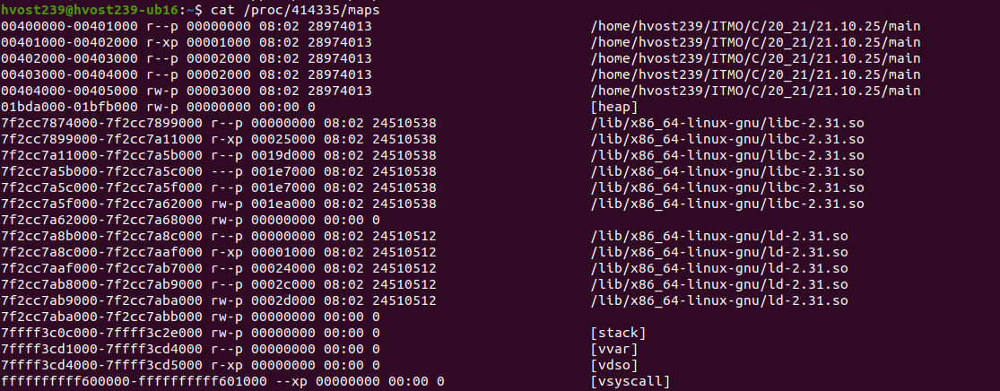
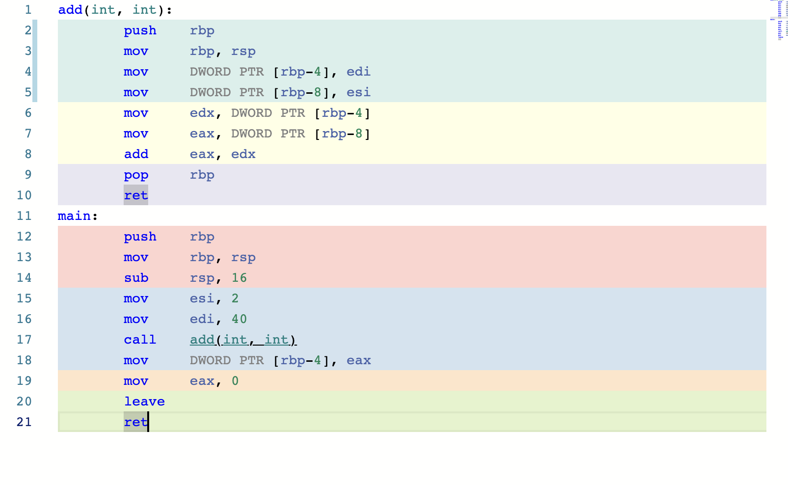
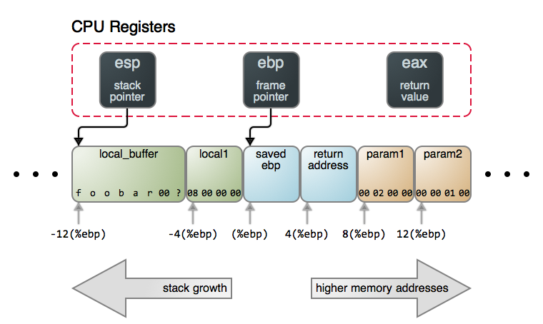
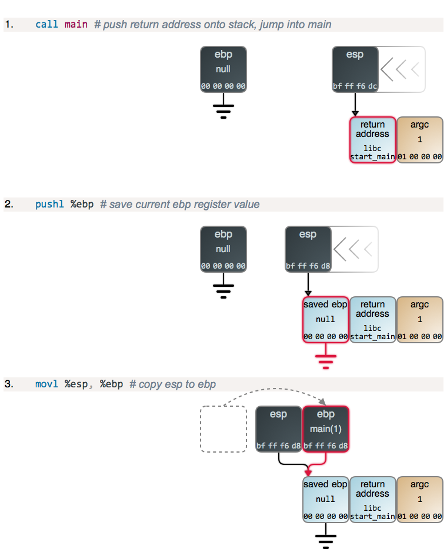
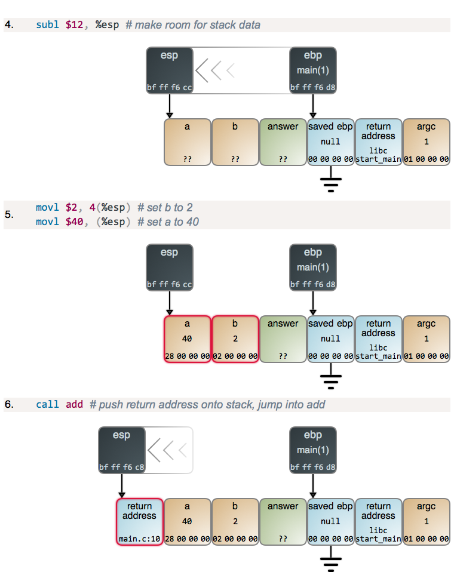
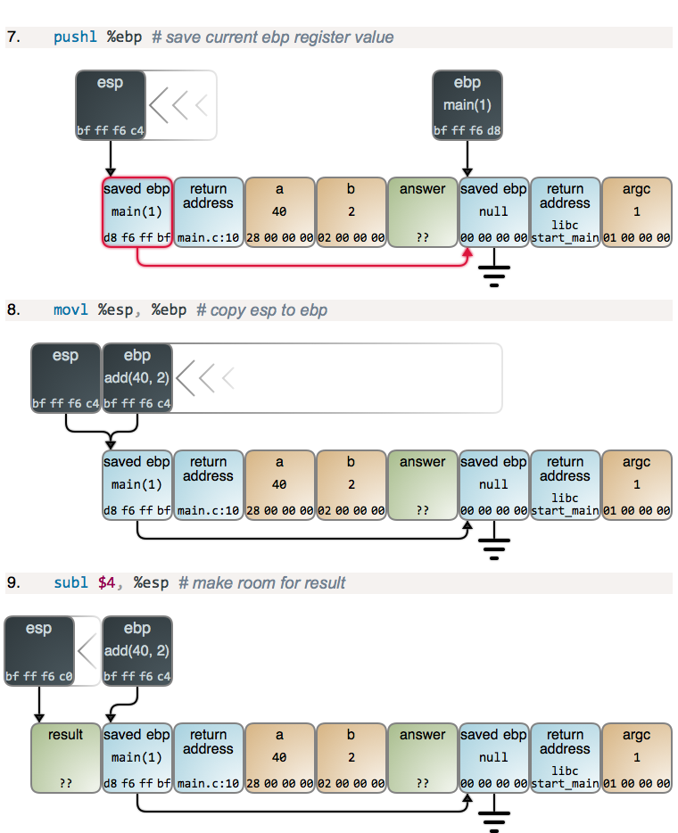
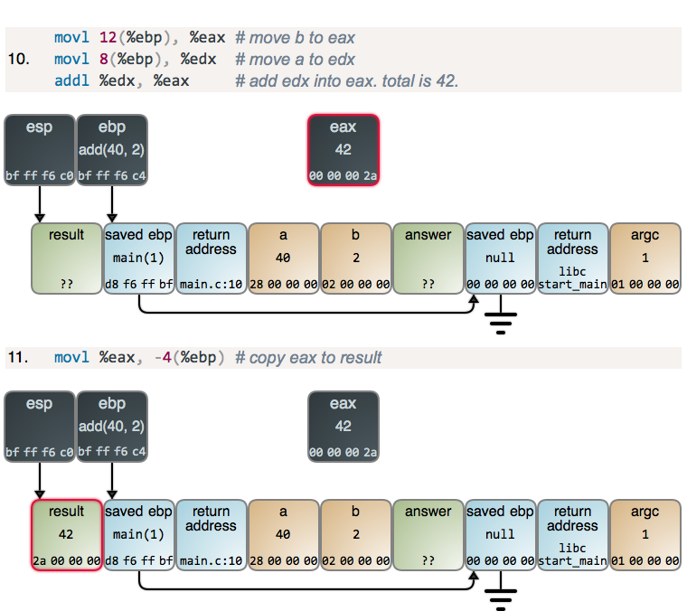

::: {.content-visible unless-format="revealjs"}

[Открыть слайды](slides/04-memory.html){.btn .btn-outline-primary target="_blank"}

> Источник: [Google Slides](https://docs.google.com/presentation/d/1wlDOCjTv4JXUY1fGPwulFewW5nLbdcsywN7jFesN-Ts/edit)

:::

## Язык С++


- Работа с памятью

## Работа программ


- Архитектура Фон Неймана\Гарвардская
- Виды памяти
- Процессор
- Прерывания

## Процессы\потоки


- Процессы
- Независимое адресное пространство
- Объекты ядра (файловые дескрипторы, объекты синхронизации и т.д. )
- Потоки
- Набор команд
- Стек

## Виртуальное адресное пространство


- У каждого процесса “своя” память
- Иллюзия доступности всех ресурсов
- Осуществляется мапинг на физическую память
- Page Table
- Segments
- ОС также реализует данную логику

## Page table

<!-- embedded-images:start -->

<!-- embedded-images:end -->


- Маппинг виртуального адреса на физически
- Изоляция процессов
- Memory-mapped file
- Обеспечение безопасного режима работы ОС
- swapping

## Представление программы в памяти

<!-- embedded-images:start -->

<!-- embedded-images:end -->


## Слайд 7

<!-- embedded-images:start -->

<!-- embedded-images:end -->


## Segments


- Stack
- Heap
- Memory Mapping
- BSS
- Data
- Text
- etc

## Segments


```cpp
int main(int argc, char* argv[]) {
    int local = 0;
    char* str = "Hello world";

    std::printf("Process id: %d\n", getpid());

    std::printf("Address of PI: %p\n", &PI);
    std::printf("Address of SomeGlobalValue %p\n", &SomeGlobalValue);
    std::printf("Address of str %p\n", str);
    std::printf("Address of SomeFunc %p\n", &SomeFunc);
    std::printf("Address of local %p\n", &local);

    getchar();
    return 0;
}
```

## Segments

<!-- embedded-images:start -->

<!-- embedded-images:end -->


## Stack (Стек вызова)


```cpp
int add(int a, int b) {
    return a + b;
}

int main() {
    int result;
    result = add(40, 2);
    return 0;
}
```

## GodBolt.org

<!-- embedded-images:start -->

<!-- embedded-images:end -->


## Стек вызова


- StackFrame
- arguments
- local variable
```cpp
return point
```

- cdecl, stdcall,  fastcall
- Регистры процессора
- esp/rsp (верхушка стека)
- ebp/rbp (начало кадра)
- eax (результат)

## Источник

<!-- embedded-images:start -->

<!-- embedded-images:end -->


## Слайд 15

<!-- embedded-images:start -->

<!-- embedded-images:end -->


## Слайд 16

<!-- embedded-images:start -->

<!-- embedded-images:end -->


## Слайд 17

<!-- embedded-images:start -->

<!-- embedded-images:end -->


## Слайд 18

<!-- embedded-images:start -->

<!-- embedded-images:end -->


## Слайд 19

<!-- embedded-images:start -->

<!-- embedded-images:end -->


## Слайд 20

<!-- embedded-images:start -->

<!-- embedded-images:end -->


## Слайд 21

<!-- embedded-images:start -->

<!-- embedded-images:end -->


## Слайд 22

<!-- embedded-images:start -->

<!-- embedded-images:end -->


## Слайд 23

<!-- embedded-images:start -->

<!-- embedded-images:end -->


## Слайд 24

<!-- embedded-images:start -->

<!-- embedded-images:end -->


## Слайд 25

<!-- embedded-images:start -->

<!-- embedded-images:end -->


## Heap (Куча)


- В отличии от стека позволяет создавать динамические структуры большого размера
- Управление жизнью объектов в куче “ручное”

## Функции работы с памятью  StdLib.h


- malloc
- free
- calloc
- realloc

## int main() {


```cpp
int* p1 = malloc(4 * sizeof(int));
int* p2 = malloc(sizeof(int[4]));

if (p1) {
    for (int n = 0; n < 4; ++n) p1[n] = n * n;
    for (int n = 0; n < 4; ++n) printf("p1[%d] == %d\n", n, p1[n]);
}
free(p1);
free(p2);
}
```

- malloc

## malloc


- malloc не гарантирует выделение памяти
- не забывать выставлять указатель в NULL после освобождения
- free(NULL) ничего не делает

## malloc


```cpp
int main() {
    int i = 0;
    int* p = malloc(sizeof(int));
    int* arr = calloc(sizeof(int), 10);

    printf("Sizeof(i): %lu \t Address of i %p\n", sizeof(i), &i);
    printf("Sizeof(p): %lu \t Address of p %p\n", sizeof(p), &p);
    printf("Sizeof(*p): %lu \t Address of *p %p\n", sizeof(*p), p);
    printf("Sizeof(arr): %lu \t Address of arr %p\n", sizeof(arr), &arr);
    printf("Sizeof(*arr): %lu \t Address of *arr %p\n", sizeof(*arr), arr);

    free(p);
    free(arr);
}
```

## new\delete


```cpp
int main() {
    int* pr = new int;
    delete pr;

    int* arr = new int[10];
    delete[] arr;

    return 0;
}
```

## Segmentation fault


- Обращение к несуществующему адресу
- Обращение к сегменту, прав для которого нет
- Попытка поменять данные в read-only сегменту
- Обращения по нулевому указателю
- Обращение по указателю на удаленный указатель
- Переполнение стека
- Переполнение буфера

## Segmentation fault


```cpp
#include <stdio.h>
#include <stdint.h>

int main(int argc, char* argv[]) {
```

- uint64_t arr[1048570]; // 8Mb
```cpp
arr[10] = 1;
return 0;
}
```

## Segmentation fault


```cpp
int main(int argc, char* argv[]) {
    char local_str[] = "Hello world";
    // char* local_str = "Hello world";

    local_str[1] = 'E';
    printf("%s\n", local_str);

    return 0;
}
```
