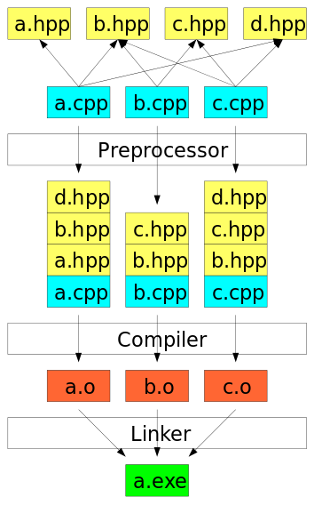

::: {.content-visible unless-format="revealjs"}

[Открыть слайды](slides/06-compiler-preprocessor.html){.btn .btn-outline-primary target="_blank"}

:::

## Язык С++


- Компиляция

## Программы состоят из файлов


- Логическое разбиение на модули
- Повторное использование
- Ускорение процесса компиляции
- Небольшие файлы проще читать и редактировать
- Есть два типа файлов
- Заголовочные (`*.h`, `*.hpp`)
- С исходным кодом (`*.cpp`)

## Этапы трансляции

<!-- embedded-images:start -->

<!-- embedded-images:end -->


- Препроцессор
- Компилятор
- Компоновщик
- NB! На самом деле этапов 9

## Этапы трансляции


- Компиляторы умеют запускать этапы трансляции по отдельности (на примере clang):
- clang++ -E              - run preprocess,
- clang++ -S              - run preprocess and compilation steps
- clang++ -c               - run preprocess, compile, and assemble steps
- clang++ --Xlinker    - run linker

## Объявление и определение


- Declaration
- Задаёт имя и другие атрибуты сущности, например сигнатуру функции
- Сколько угодно раз
- Definition
- Полностью определяет сущность
- Одновременно является объявлением

## Объявление и определение


- // declaration
```cpp
int add(int a, int b);
// definition
int add(int a, int b) {
    return a + b;
}
```

## Объявление и определение


- // math.cpp
- //definition
```cpp
int add(int a, int b) {
    return a + b;
}
// main.cpp
int add(int a, int b);

int main() {
    int i = add(10, 2);
    return 0;
}
```

## Заголовочный файл


- Function declaration & definition
- Variable declaration
- Type declaration
- Static variable definition  & declaration
- …

## Заголовочные файлы


- // math.h
- #pragma once
```cpp
int add(int a, int b);
```

## Заголовочные файлы


- // math.h
- #pragma once
```cpp
int add(int a, int b);
// main.cpp
#include "math.h"

int main(int, char**) {
    int c = add(10, 2);
    return 0;
}
```

## Препроцессор


- Язык препроцессора – это специальный язык программирования, встроенный в C++.
- Лексический анализ кода.
- Команды языка препроцессора называют директивами, все директивы начинаются со знака #.
- Директива #include позволяет подключать заголовочные файлы к файлам кода.
- Препроцессор заменяет директиву #include "bar.h" на содержимое файла bar.h.

## Препроцессор


- Макросы: `#define`, `#undef`
- Предопределённые макросы: `__FILE__`, `__LINE__`
- Операторы макросов: `#` и `##`
- Условное включение: `#if`, `#ifdef`, `#ifndef`, `#elif`, `#else`, `#endif`
- Подключение файлов:

```cpp
#include <filename>

#include "filename"
```

- Другие директивы: `#pragma once`, `#error`

## \#include


```cpp
#include "math.h"

int main(int, char**) {
    int c = add(10, 2);
    return 0;
}
```

## \#include


- # 1 "main.cpp"
- # 1 "<built-in>" 1
- # 1 "<built-in>" 3
- # 537 "<built-in>" 3
- # 1 "<command line>" 1
- # 1 "<built-in>" 2
- # 1 "main.cpp" 2
- # 1 "./math.h" 1
```cpp
int add(int a, int b);
# 2 "main.cpp" 2
int main(int, char**) {
    int c = add(10, 2);
    return 0;
}
```

- clang++ -E main.cpp

## Макросы


- Макросами в C++ называют инструкции препроцессора.
- Препроцессор C++ является самостоятельным языком, работающим с произвольными строками.
- Макросы можно использовать для определения функций:
- Препроцессор “не знает” про синтаксис C++.

## Макросы


```{.cpp filename="macro-max.cpp"}

```

[{.godbolt-link-image width="32"}][godbolt-06-macro-max]{aria-label="Open in Compiler Explorer"}

## Макросы


- content of iostream
- # 2 "main.cpp" 2
```cpp
int main() {
    std::cout << (10 > 20 ? 10 : 20) << std::endl;

    return 0;
}
```

- clang++ -E main.cpp

## Макросы


```cpp
#ifdef __DEBUG__
#define error_log(format, ...) \
    printf("[ERROR] (%s:%d) " format "\n", __FILE__, __LINE__, ##__VA_ARGS__)
#else
#define error_log(format, ...)
#endif

int main() {
    error_log("fatal error no: %d", 1);

    return 0;
}
```

## Макросы


```cpp
#define log(type, format, ...) \
    printf("[" type "] (%s:%d) " format "\n", __FILE__, __LINE__, ##__VA_ARGS__)

#define log_error(...) log("ERORR", ##__VA_ARGS__)
#define log_info(...) log("INFO", ##__VA_ARGS__)
```

## Стражи


```cpp
#ifndef HEADER_MATH_H
#define HEADER_MATH_H

int add(int a, int b);

#endif
#pragma once
int add(int a, int b);
```

## pragma pack


- #pragma pack(1)
```cpp
struct SomeStruct {
    int i;
    char ch;
};
#pragma pack
int main() {
    printf("%d\n", sizeof(struct SomeStruct));
    return 0;
}
```

## Компилятор


- На вход компилятору поступает код на C++ после обработки препроцессором.
- Каждый файл с кодом компилируется отдельно и независимо от других файлов с кодом.
- Компилируются только файлы с кодом, то есть `*.cpp`.
- Заголовочные файлы сами по себе ни во что не компилируются, только в составе файлов с кодом.
- На выходе компилятора из каждого файла с кодом получается “объектный файл” — бинарный файл со скомпилированным кодом (с расширением .o или .obj).

## Компилятор


- // math.cpp
```cpp
void increment(int& v) {
    v++;
}

int add(int a, int b) {
    return a + b;
}
// main.cpp
int main(int, char**) {
    int x = 1;
    int y = 2;

    increment(y);
    int result = add(x, y);

    return 0;
}
```

## .text


- .globl	_Z9incrementRi          # -- Begin function _Z9incrementRi
- .p2align	4, 0x90
- .type	_Z9incrementRi,@function
- _Z9incrementRi:                         # @_Z9incrementRi
- .cfi_startproc
- # %bb.0:
- pushq	%rbp
- .cfi_def_cfa_offset 16
- .cfi_offset %rbp, -16
- movq	%rsp, %rbp
- .cfi_def_cfa_register %rbp
- movq	%rdi, -8(%rbp)
- movq	-8(%rbp), %rax
- movl	(%rax), %ecx
- addl	$1, %ecx
- movl	%ecx, (%rax)
- popq	%rbp
- .cfi_def_cfa %rsp, 8
- retq
- .Lfunc_end1:
- .size	_Z9incrementRi, .Lfunc_end1-_Z9incrementRi
- .cfi_endproc
- # -- End function

## main:                                   \# @main


- .cfi_startproc
- # %bb.0:
- pushq	%rbp
- .cfi_def_cfa_offset 16
- .cfi_offset %rbp, -16
- movq	%rsp, %rbp
- .cfi_def_cfa_register %rbp
- subq	$48, %rsp
- movl	$0, -4(%rbp)
- movl	%edi, -8(%rbp)
- movq	%rsi, -16(%rbp)
- movl	$1, -20(%rbp)
- movl	$2, -24(%rbp)
- leaq	-24(%rbp), %rdi
- callq	_Z9incrementRi

## Компоновщик(линкер)


- На этом этапе все объектные файлы объединяются в один исполняемый (или библиотечный) файл.
- При этом происходит подстановка адресов функций в места их вызова.
- По каждому объектному файлу строится таблица всех функций, которые в нём определены.

## Компоновщик(линкер)


- // math.h
- #pragma once
```cpp
void increment(int& v);
int add(int a, int b);

#include <iostream>

#include "math.h"

int main(int, char**) {
    int x = 1;
    int y = 2;

    increment(y);
    int result = add(x, y);

    std::cout << result << std::endl;

    return 0;
}
// math.cpp
#include "math.h"
void increment(int& v) {
    ++v;
}

int add(int a, int b) {
    return a + b;
}
```

## Linkage


- External - доступность из всех единиц трансляции
- Internal - доступность из текущей единицы трансляции
- No linkage — только текущая область видимости

## Storage duration


- automatic — время жизни ограничено областью объявления
- static — время жизни от запуска программы до её окончания
- thread — время жизни ограничено потоком
- dynamic — `new`/`delete`

## Storage class specifier


- `static` на уровне пространства имён — static storage duration и internal linkage
- локальная `static`-переменная — static storage duration без linkage
- `extern` — объявление имени с external linkage
- `thread_local` — thread storage duration
- `mutable` разрешает изменять поле `const`-объекта

## Storage duration and linkage


- // math.h
- #pragma once
```cpp
const static float PI = 3.14f;
const extern float Exp;
const int SomeValue = 239;
static float PI2 = 3.14f;
extern float Exp2;
// int SomeValue2 = 239; // error: multiple definition of `SomeValue2';

void PrintInfo();
```

## Storage duration and linkage


- // math.cpp
```cpp
#include <iostream>

#include "math.h"

void PrintInfo() {
    std::cout << PI << " Address of PI:" << &PI << std::endl;
    std::cout << Exp << " Address of Exp:" << &Exp << std::endl;
    std::cout << SomeValue << " Address of Exp:" << &SomeValue << std::endl;
    std::cout << PI2 << " Address of PI:" << &PI2 << std::endl;
    std::cout << Exp2 << " Address of Exp:" << &Exp2 << std::endl;
}
```

## Storage duration and linkage


```cpp
#include <iostream>

#include "math.h"
const float Exp = 2.72f;
float Exp2 = 2.72f;

int main(int, char**) {
    PI2 = 3;
    Exp2 = 2;
    std::cout << PI << " Address of PI:" << &PI << std::endl;
    std::cout << Exp << " Address of Exp:" << &Exp << std::endl;
    std::cout << SomeValue << " Address of Exp:" << &SomeValue << std::endl;
    std::cout << PI2 << " Address of PI:" << &PI2 << std::endl;
    std::cout << Exp2 << " Address of Exp:" << &Exp2 << std::endl;
    std::cout << "----Math-----\n";
    PrintInfo();
    return 0;
}
```

## Storage duration and linkage


- 3.14 Address of PI:0x402018
- 2.72 Address of Exp:0x402014
- 239  Address of Exp:0x40201c
- 3    Address of PI:0x404074
- 2    Address of Exp:0x404070
- ---Math-----
- 3.14 Address of PI:0x402050
- 2.72 Address of Exp:0x402014
- 239  Address of Exp:0x402054
- 3.14 Address of PI:0x404078
- 2    Address of Exp:0x404070

## Ошибки компиляции


- Ошибки компиляции
- Ошибки линковки

[godbolt-06-macro-max]: <https://godbolt.org/#g:!((g:!((h:codeEditor,i:(j:1,lang:c%2B%2B,options:(compileOnChange:'0'),source:'%23include+%3Ciostream%3E%0A%0A%23define+MAXIMUM(x,+y)+((x)+%3E+(y)+%3F+(x)+:+(y))%0A%0Aint+main()+%7B%0A++++std::cout+%3C%3C+MAXIMUM(10,+20)+%3C%3C+!'%5Cn!'%3B%0A%0A++++return+0%3B%0A%7D%0A'),l:'5'),(h:executor,i:(compilationPanelShown:'0',compiler:clang2310,compilerOutShown:'0',lang:c%2B%2B,libs:!(),options:'-std%3Dc%2B%2B20+-O0',source:1,tree:0),l:'5')),l:'2')),version:4>
<!-- godbolt source="examples/06-compiler-preprocessor/macro-max.cpp" compiler="clang2310" options="-std=c++20 -O0" -->
