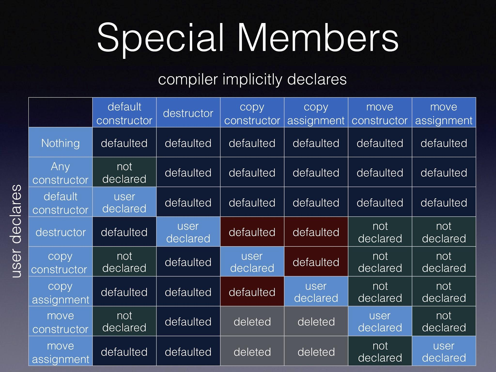

::: {.content-visible unless-format="revealjs"}

[Открыть слайды](slides/07-oop-abstraction-encapsulation.html){.btn .btn-outline-primary target="_blank"}

:::

## Язык С++


- ООП. Абстракция. Инкапсуляция.

## ООП


- Абстракция
- Инкапсуляция
- Наследование
- Полиморфизм

## Абстракция


- придание объекту характеристик, которые чётко определяют его концептуальные границы, отличая от всех других объектов. Основная идея состоит в том, чтобы отделить способ использования составных объектов данных от деталей их реализации в виде более простых объектов

## Stack. C


```cpp
#define MAX_STACK_SIZE 10
struct SStack {
    int arr[MAX_STACK_SIZE];
    size_t size;
};
```

## Stack. C


```cpp
struct SStack {
    int* arr;
    size_t size;
};
```

## Stack. C


```cpp
void push(struct SStack* stack, int value);
void pop(struct SStack* stack);
int top(struct SStack* stack);
int empty(struct SStack* stack);
SStack createStack();
```

## Stack. C


```cpp
int main() {
    SStack stack = createStack();
    stack.size = 100500;  // OOps
    stack.arr = NULL;     // OOps
}
```

## Инвариант


- Инвариант в объектно-ориентированном программировании — выражение, определяющее непротиворечивое внутреннее состояние объекта.

## Date. C


```cpp
struct Data {
    int32_t Year;
    int32_t Month;
    int32_t Day;
    int32_t timestamp;  // seconds after January 1st, 1970
}
```

## Date. C


```cpp
Date CreateDate(int32_t year, int32_t month, int32_t day) {
    Date date;

    date.Year = year;
    date.Month = month;
    date.Day = day;
    date.timestamp = (year - 1970) * 31556926 + month * 2629743 + day * 86400;

    return date;
}
```

## Date. С


```cpp
int main() {
    Data date = CreateDate(2023, 11, 1);

    date.Day = 65;
    date.Month = 100;
    date.Timestamp = 10050;

    return 0;
}
```

## Проблемы


- Можем менять данные, которые не должны быть доступны.
- Нарушение инварианта по отдельным данным
- Нарушения инварианта в целом

## class


- универсальный, комплексный тип данных, состоящий из тематически единого набора «полей» (переменных более элементарных типов) и «методов» (функций для работы с этими полями), то есть он является моделью информационной сущности с внутренним и внешним интерфейсами для оперирования своим содержимым (значениями полей).

## class


- Конструкторы
- Деструктор
- this
- Модификаторы доступа
- public
- private
- protected
- Вложенные классы
- Статические поля
- Перегрузка операторов
- ……..

## Инкапсуляция


- это фундаментальный принцип объектно-ориентированного программирования, заключающийся в объединении данных (состояния) и методов (поведения), которые с ними работают, в единую логическую единицу, (а также в скрытии внутренних деталей реализации от внешнего мира)

## Stack. C++


```cpp
class CIntStack {
   public:
    void push(int value);
    void pop();
    bool empty() const;
    int top() const;
};
```

## Stack. C++


```cpp
class CIntStack {
   public:
    void push(int value);
    void pop();
    bool empty() const;
    int top() const;

   private:
    int* data_;
    size_t size_;
};
```

## Stack. C++


```cpp
class CIntStack {
   public:
    void push(int value);
    void pop();
    bool empty() const;
    int top() const;

   private:
    int data_[100500];
    size_t size_;
};
```

## Stack. C++


```cpp
class CIntStack {
   public:
    void push(int value);
    void pop();
    bool empty() const;
    int top() const;

   private:
    std::vector<int> data_;
};
```

## class Date {


```cpp
public:
Data(int32_t year, Month month, uint8_t day);  // need validate year + month + day
int32_t Year() const;
Month Month() const;
uint8_t Day() const;
uint32_t Timestamp() const;

private:
int32_t year_ = 0;
Month month_;
uint8_t day_;
}
```

- Date. С++

## Date. С++


```cpp
class Date {
   public:
    Data(int32_t year, Month month, uint8_t day);  // need validate year + month + day
    int32_t Year() const;
    Month Month() const;
    uint8_t Day() const;
    uint32_t Timestamp() const;

   private:
    uint32_t timestamp_;
}
```

## class


- Конструкторы
- Деструктор
- this
- Модификаторы доступа
- public
- private
- protected
- Вложенные классы
- Статические поля
- Перегрузка операторов
- ……..

## Rational number


```cpp
class CRational {
   private:
    int numerator_;
    unsigned denominator_;
};
```

## Access Modifiers


- public
- protected
- private

## Constructor


- Специальный, не статический метод, используемый для инициализации объекта (обеспечивает инвариант).
- Название этого метода совпадает с именем класса
- Виды конструкторов:
- default constructor
- converting constructor
- copy constructor
- move constructor

## Constructor


```cpp
class CRational {
   public:
    CRational(int numerator = 0, unsigned denominator = 1)  // default constructor
        : numerator_(numerator), denominator_(denominator) {
    }

   private:
    int numerator_;
    unsigned denominator_;
};
```

- // CRational(5, 10) != CRational(1, 2)

## Constructor


- CRational(int numerator=0 , unsigned denominator=1) // default constructor
- : numerator_(numerator)
- , denominator_(denominator)
```cpp
{
    unsigned gcd = std::gcd(numerator_, denominator_);
    numerator_ /= gcd;
    denominator_ /= gcd;
}
CRational(const CRational& other)  // copy constructor
    : numerator_(other.numerator_), denominator_(other.denominator_) {
}
CRational(CFraction&& other)  // move constructor
    : numerator_(std::exchange(other.numerator_, 0)),
      denominator_(std::exchange(other.denominator_, 0)) {
}
```

## Method


```cpp
public:
int numerator() const {
    return numerator_;
}

unsigned denominator() const {
    return denominator_;
}
```

## !NB. const method


```cpp
int numerator() const {
    denominator_ = 1;  // compile-time error
    return numerator_;
}
```

## Destructor


```cpp
~CRational() {
    // erase resources if needed
}
```

## operator=


```cpp
CRational& operator=(const CRational& other) {
    if (&other == this) return *this;

    numerator_ = other.numerator_;
    denominator_ = other.denominator_;

    return *this;
}
```

## By reference / by value


```cpp
void PrintRational(const CRational& number) {
    std::cout << number.numerator() << '/' << number.denominator() << '\n';
}

int main() {
    CRational value{5, 10};

    PrintRational(value);
    return 0;
}
```

- Более логично перегрузить оператор вывода (см. следующую лекцию)

## Default Constructor


```cpp
class GeoPoint {
   private:
    CRational lat_;
    CRational lon_;
};

int main() {
    GeoPoint p;
    return 0;
}
```

## Default Constructor


```cpp
class GeoPoint {
   public:
    GeoPoint(const CRational& lat, const CRational& lon) : lat_(lat), lon_(lon) {
    }

   private:
    CRational lat_;
    CRational lon_;
};

int main() {
    GeoPoint p;  // compile-time error
    return 0;
}
```

## Порядок конструирования объекта


```cpp
class GeoPoint {
   public:
    GeoPoint() {
    }
    GeoPoint(const CRational& lat, const CRational& lon) : lat_(lat), lon_(lon) {
    }

   private:
    CRational lat_;
    CRational lon_;
};

int main() {
    GeoPoint p;
    return 0;
}
```

## default, delete


```cpp
class GeoPoint {
   public:
    GeoPoint() = default;
    GeoPoint(const GeoPoint&) = delete;
    GeoPoint(const CRational& lat, const CRational& lon) : lat_(lat), lon_(lon) {
    }
    ~GeoPoint() {
    }

   private:
    CRational lat_;
    CRational lon_;
};
```

## NonCopyable


```cpp
class NonCopyable {
   public:
    NonCopyable(const NonCopyable&) = delete;
    NonCopyable& operator=(const NonCopyable&) = delete;

   protected:
    NonCopyable() = default;
    ~NonCopyable() = default;  /// Protected non-virtual destructor
};

class CantCopy : private NonCopyable {};
```

## Неявное преобразование типов


```cpp
int main() {
    CRational r = 1;
    PrintRational(2);
    return 0;
}
```

## Неявное преобразование типов


- explicit CRational(int numerator=0 , unsigned denominator=1)
- : numerator_(numerator)
- , denominator_(denominator)
```cpp
{
    unsigned gcd = std::gcd(numerator_, denominator_);
    numerator_ /= gcd;
    denominator_ /= gcd;
}

int main() {
    CRational r = 1;   // compile-time error
    PrintRational(2);  // compile-time error
    return 0;
}
```

## © Howard Hinnant

<!-- embedded-images:start -->

<!-- embedded-images:end -->


## Rule of three


- Если определён хотя бы один из трёх методов, обычно необходимо определить все три
- Destructor
- Copy constructor
- Copy assignment operator

## Rule of five


- Если определён хотя бы один из пяти методов, обычно необходимо определить все пять
- Destructor
- Copy constructor
- Copy assignment operator
- Move constructor
- Move assignment operator

## Rule of three


```cpp
class CIntArray {
   public:
    CIntArray(size_t size) : size_(size), data_(new int[size]) {
    }

    ~CIntArray() {
        delete[] data_;
    }

   private:
    int* data_;
    size_t size_;
};
```

## Rule of three


```cpp
int main() {
    CIntArray r1(10);
    CIntArray r2(20);

    r1 = r2;

    return 0;
}
```

## Rule of three


```cpp
class CIntArray {
   public:
    CIntArray& operator=(const CIntArray& other) {
        delete[] data_;
        data_ = new int[other.size_];
        size_ = other.size_;
        std::memcpy(other.data_, data_, sizeof(int) * size_);

        return *this;
    }
};
```

## Rule of three


```cpp
int main() {
    CIntArray r1(10);
    CIntArray r2 = r1;

    return 0;
}
```

## Rule of three


```cpp
class CIntArray {
   public:
    CIntArray(const CIntArray& other) : size_(other.size_), data_(new int[other.size_]) {
        std::memcpy(other.data_, data_, sizeof(int) * size_);
    }
};
```

## new/delete


```cpp
int main() {
    CRational* pR = new CRational{1, 2};
    PrintRational(*pR);
    delete pR;
}
```

## class/struct
