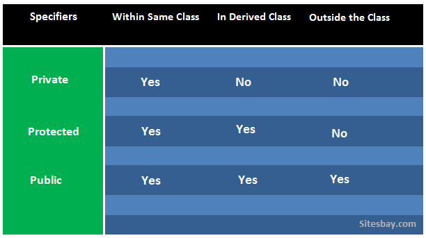
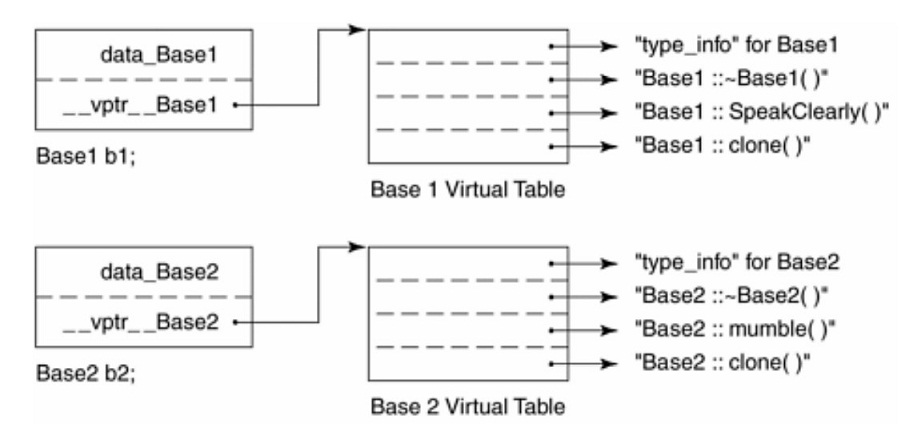

::: {.content-visible unless-format="revealjs"}

[Открыть слайды](slides/09-oop-inheritance-polymorphism.html){.btn .btn-outline-primary target="_blank"}

> Источник: [Google Slides](https://docs.google.com/presentation/d/1biio_zFvspHq_OjWmjsrvfrRXsj3seYrmsTfUlBW0Yo/edit)

:::

## Язык С++


- ООП. Наследование и Полиморфизм

## Наследование


```cpp
class CPerson {
   public:
    CPerson(const std::string& name, unsigned yearOfBirth)
```

- : yearOfBirth_(yearOfBirth)
```cpp
, name_(name) {}

unsigned age() const {
    const std::chrono::time_point now{std::chrono::system_clock::now()};
    const std::chrono::year_month_day ymd{std::chrono::floor<std::chrono::days>(now)};

    return static_cast<int>(ymd.year()) - yearOfBirth_;
}
const std::string& name() const {
    return name_;
}

private:
std::string name_;
unsigned yearOfBirth_;
}
;
```

## Наследование


- позволяет описать новый класс на основе уже существующего с частично или полностью заимствующейся функциональностью. Класс, от которого производится наследование, называется базовым, родительским или суперклассом. Новый класс — потомком, наследником, дочерним или производным классом.
- полиморфизм подтипов, is-a relationship
- обеспечивает повторное использование кода (следствие но не причина)
- множественное наследование

## Наследование


```cpp
class CStudent : public CPerson {
   public:
    CStudent(const std::string& name, unsigned age, const std::string& university)
```

- : CPerson(name, age)
- , university_(university)
```cpp
{
}

private:
std::string university_;
}
;
```

## Наследование


- Наследник:
- Хранит в себе родителя
- Сохраняет методы родителя*
- Приведение к базовому классу (slicing)
- Модификаторы доступа

## Constructor\Destructor order


## Наследование

<!-- embedded-images:start -->

<!-- embedded-images:end -->


## Наследование


```cpp
class CStudent : public CPerson {
   public:
    CStudent(const std::string& name, unsigned yearOfBirth, const std::string& university)
```

- : CPerson(name, yearOfBirth)
- , university_(university)
```cpp
{
}

const std::string& university() const {
    return university_;
}

void Hello() const {
    std::cout << "Hello. I'am " << name() << " I'am from " << university_ << std::endl;
}

private:
std::string university_;
}
;
```

## Наследование


- // CBudgetStudent is a CStudent. CStudent is a CPerson
```cpp
class CBudgetStudent : public CStudent {
   public:
    CBudgetStudent(const std::string& name, unsigned yearOfBirth, const std::string& university,
                   unsigned sallary)
```

- : CStudent(name, yearOfBirth, university)
- , sallary_(sallary)
```cpp
{
}

private:
unsigned sallary_;
}
;
```

## is-a relationship


```cpp
void Hello(const CStudent& p) {
    p.Hello();
}

int main() {
    CBudgetStudent st = {"Ivan Ivanov", 2002, "ITMO", 20000};
    Hello(st);
    return 0;
}
```

## Наследование, устройство в памяти


```cpp
int main(int, char**) {
    std::cout << "sizeof(CPerson): " << sizeof(CPerson) << std::endl;
    std::cout << "sizeof(CStudent): " << sizeof(CStudent) << std::endl;
    std::cout << "sizeof(CBudgetStudent): " << sizeof(CBudgetStudent) << std::endl;
}
```

## Иерархия геометрических фигур


- Shape
- Triangle
- Circle
- Square
- Rectangle
- void double_width(Rectangle& r)
```cpp
{
    r.setWidth(r.width * 2);
}
```

## Иерархия геометрических фигур


- Shape
- Triangle
- Circle
- Rectangle
- Square
```cpp
double area(Square& s) {
    return s.width() * s.width();
}
```

## Иерархия геометрических фигур


- Shape
- Triangle
- Circle
- Rectangle
- Square

## Множественное наследование


```cpp
class CEmployee : public CPerson {
   public:
    CEmployee(const std::string& name, int yearOfBirth, unsigned sallary)
```

- : CPerson(name, yearOfBirth)
- , sallary_(sallary)
```cpp
{
}

private:
unsigned sallary_;
}
;
```

## Множественное наследование


```cpp
class CIntern : public CEmployee, public CBudgetStudent {
   public:
```

- CIntern(
```cpp
const std::string &name,
```

- int yearOfBirth,
```cpp
const std::string &university,
```

- unsigned universSallary,
- unsigned workSallary
- )
- : CEmployee(name, yearOfBirth, workSallary)
- , CBudgetStudent(name, yearOfBirth, university, universeSallary)
```cpp
{
}
}
;
```

## Множественное наследование


```cpp
int main(int, char**) {
    std::cout << "sizeof(CPerson): " << sizeof(CPerson) << std::endl;
    std::cout << "sizeof(CStudent): " << sizeof(CStudent) << std::endl;
    std::cout << "sizeof(CBudgetStudent): " << sizeof(CBudgetStudent) << std::endl;

    std::cout << "sizeof(CEmployee): " << sizeof(CEmployee) << std::endl;
    std::cout << "sizeof(CIntern): " << sizeof(CIntern) << std::endl;
}
```

## Diamond Problem


```cpp
int main(int, char**) {
    CIntern intern("Ivan Ivanov", 2002, "ITMO", 20000, 50000);

    intern.Hello();

    // std::cout << intern.name();  compile-time error

    std::cout << intern.CEmployee::name() << std::endl;
    std::cout << intern.CBudgetStudent::name() << std::endl;
    return 0;
}
```

## Проблемы множественного наследования


```cpp
class CEmployee : public CPerson {
   public:
    void IncreaseSallary() {
        sallary_ += 1000;
    }

   protected:
    unsigned sallary_;
};

class CBudgetStudent : public CStudent {
   public:
    void IncreaseSallary() {
        sallary_ += 1000;
    }

   protected:
    unsigned sallary_;
};

class CIntern : public CEmployee, public CBudgetStudent {
   public:
    using CEmployee::IncreaseSallary;

    unsigned Sallary() const {
        return CEmployee::sallary_ + CBudgetStudent::sallary_;
    }
};

int main(int, char**) {
    CIntern intern("Ivan Ivanov", 2002, "ITMO", 20000, 50000);

    intern.IncreaseSallary();
    std::cout << intern.Sallary() << std::endl;

    return 0;
}
```

## final


## Полиморфизм


- свойство системы, позволяющее использовать объекты с одинаковым интерфейсом без информации о типе и внутренней структуре объекта.

## Динамический полиморфизм


- Позднее и раннее связывание
- Виртуальные функции

## Виртуальные функции


```cpp
class ILogger {
   public:
    virtual void Log(const char* message) {}

    virtual ~ILogger() = default;
};

class CConsoleLogger : public ILogger {
   public:
```

- void Log(const char* message) override {
```cpp
std::cout << message << std::endl;
}
}
;
```

## Виртуальные функции


```cpp
class CFileLogger : public ILogger {
   public:
```

- CFileLogger(const char* filename)
- : stream_(filename)
```cpp
{
}

~CFileLogger() {
    stream_.close();
}

CFileLogger(const CFileLogger&) = delete;
CFileLogger& operator=(const CFileLogger&) = delete;
```

- void Log(const char* message) override {
```cpp
stream_ << message << std::endl;
}

private:
std::ofstream stream_;
}
```

## Таблица виртуальных функций


- Таблица заводится для любого класс с виртуальной функции
- Вызов виртуального метода — это вызов метода по адресу из таблицы
- Стандарт не определяет механизм реализации виртуальных функций, однако большинство компиляторов реализуют именно таблицу вирутальных функций

## Слайд 26

<!-- embedded-images:start -->

<!-- embedded-images:end -->


## override


```cpp
class ILogger {
   public:
    virtual void Log(const char* message) {}

    virtual ~ILogger() = default;
};

class CConsoleLogger : public ILogger {
   public:
```

- void Log(const char* message) override {
```cpp
std::cout << message << std::endl;
}
}
;
```

## final


```cpp
class CConsoleLogger : public ILogger {
   public:
```

- void Log(const char* message) final {
```cpp
std::cout << message << std::endl;
}
}
;

class CModernConsoleLogger : public CConsoleLogger {
   public:
```

- void Log(const char* message) override {   // Compile-time error
```cpp
std::print("{0}", message);
}
}
;
```

## Virtual destructor


```cpp
class Base {
   public:
    Base() {
        std::cout << "Base\n";
    }
    virtual ~Base() {
        std::cout << "~Base\n";
    }
};

class Derrived : public Base {
   public:
    Derrived() {
        std::cout << "Derrived\n";
    }
    ~Derrived() {
        std::cout << "~Derrived\n";
    }
};

int main(int, char**) {
    Base* d = new Derrived;
    delete d;

    return 0;
}
```

## Абстрактный класс


```cpp
class ILogger {
   public:
    virtual void Log(const std::string& msg) = 0;  // pure virtual function
    virtual ~ILogger() = default;
};

int main(int, char**) {
```

- ILogger log;  // Error : variable type 'ILogger' is an abstract class
```cpp
return 0;
}
```

- класс экземпляр которого не может быть создан
- обычно используется в качестве базового класса
- содержит хотя бы 1 pure virtual function (чисто виртуальную функцию)

## Коллекции полиморфных объектов


## Non-Virtual Interface  Idiom


```cpp
class Base {
   public:
    void doWork() {
        preWork();
        doWorkImpl();
        postWork();
    }

   protected:
    virtual void doWorkImpl() = 0;

   private:
    void preWork() {
        cout << "Preparing...\n";
    }
    void postWork() {
        cout << "Cleaning up...\n";
    }
};

class Derived : public Base {
   protected:
```

- void doWorkImpl() override {
```cpp
cout << "Doing work in Derived\n";
}
}
;
```

## Virtual Friend Function Idiom


```cpp
class Base {
   public:
    virtual ~Base() = default;
    friend std::ostream& operator<<(std::ostream& stream, const Base& value);

   protected:
    virtual void printImpl(std::ostream& stream) const {
        stream << "Base\n";
    }
};

std::ostream& operator<<(std::ostream& stream, const Base& value) {
    value.printImpl(stream);
    return stream;
}
```

## Virtual Friend Function Idiom


```cpp
class Derrived : public Base {
   protected:
    void printImpl(std::ostream& stream) const override {
        stream << "Derrived\n";
    }
};
```

## Стоимость виртуальных функций


- Лишнее обращение к таблице вместо явного адреса
- Не возможно сделать inline optimization
- Для коллекций объектов - они всегда в куче
- Порядок объектов также может влиять на скорость

## ООП


- Абстракция
- Инкапсуляция
- Наследование
- Полиформизм
