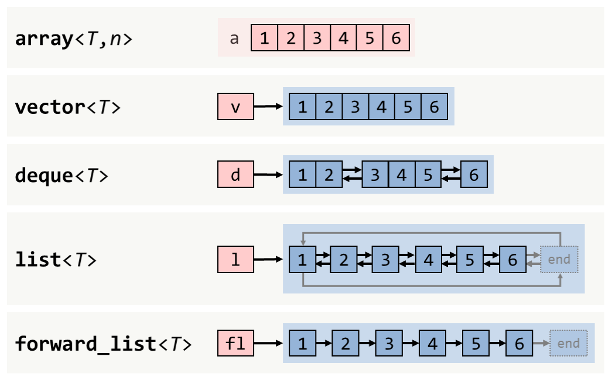
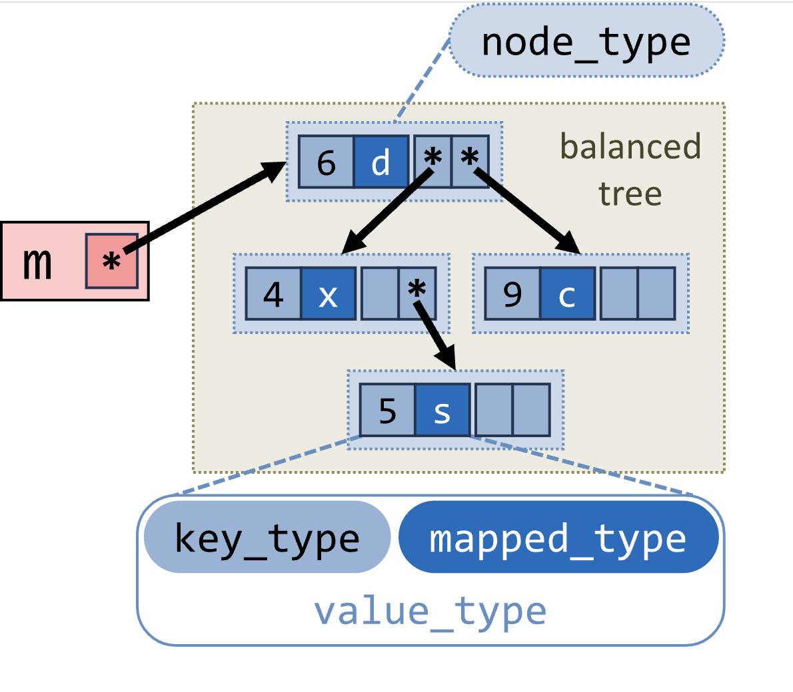
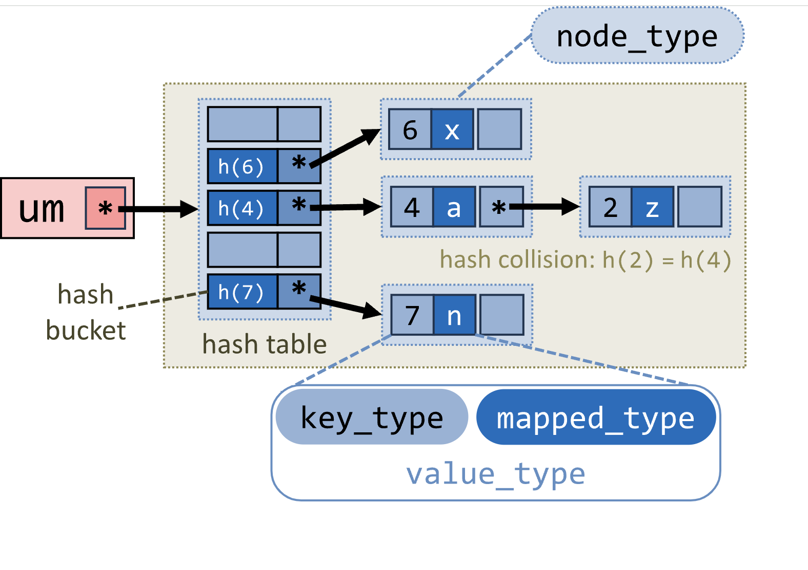

::: {.content-visible unless-format="revealjs"}

[Открыть слайды](slides/14-stl-containers-iterators-algorithms-ii.html){.btn .btn-outline-primary target="_blank"}

:::

## Язык С++


- STL. Контейнеры, итераторы, алгоритмы - II

## Стандартные функциональные объекты


- `minus`
- `multiplies`
- ….
- equal_to
- not_equal_to
- greater
- ...
- logical_and
- …
- bit_and
- Функциональные объекты

## Контейнеры


- Контейнеры последовательностей:
- vector<T>
- deque<T>
- list<T>
- array<T>
- forward_list<T>
- Ассоциативные контейнеры:
- set<Key> (multiset)
- map<Key,T> (multimap)
- Неупорядоченные ассоциативные контейнеры
- unordered_set<Key> (multiset)
- unordered_map<Key, T> (unordered_multimap)

## Named Requirements


- Container
- ReversibleContainer
- AllocatorAwareContainer
- SequenceContainer
- ContiguousContainer
- AssociativeContainer
- UnorderedAssociativeContainer
- etc

## Sequence containers


- array
- vector
- deque
- forward_list
- list
```cpp
template <class T, class Allocator = std::allocator<T>>
class vector;
```

## std::array


- Container
- ReversibleContainer
- SequenceContainer
- ContiguousContainer

## std::array Container requirements


```cpp
template <class _Tp, size_t _Size>
struct array {
    typedef _Tp value_type;
    typedef value_type& reference;
    typedef const value_type& const_reference;
    typedef value_type* iterator;
    typedef const value_type* const_iterator;
    typedef size_t size_type;
    typedef ptrdiff_t difference_type;

    _Tp __elems_[_Size];

    // Остальные члены класса опущены.
};
```

## std::array Container requirements


```cpp
iterator begin() {
    return iterator(data());
}
const_iterator begin() const {
    return const_iterator(data());
}
iterator end() {
    return iterator(data() + _Size);
}
const_iterator end() const {
    return const_iterator(data() + _Size);
}

size_type size() const {
    return _Size;
}
size_type max_size() const {
    return _Size;
}
bool empty() const {
    return _Size == 0;
}
```

## std::array ReversibleContainer requirements


```cpp
typedef _VSTD::reverse_iterator<iterator> reverse_iterator;
typedef _VSTD::reverse_iterator<const_iterator> const_reverse_iterator;

reverse_iterator rbegin() {
    return reverse_iterator(end());
}
const_reverse_iterator rbegin() const {
    return const_reverse_iterator(end());
}
reverse_iterator rend() {
    return reverse_iterator(begin());
}
const_reverse_iterator rend() const {
    return const_reverse_iterator(begin());
}
```

## Sequence containers

<!-- embedded-images:start -->

<!-- embedded-images:end -->


- © hackingcpp.com

## Associative containers


- set
- map
- multiset
- multimap
```cpp
template <class Key, class T, class Compare = std::less<Key>,
          class Allocator = std::allocator<std::pair<const Key, T> > >
class map;
```

## Unordered associative containers


- unordered_set
- unordered_map
- unordered_multiset
- unordered_multimap
```cpp
template <class Key, class T, class Hash = std::hash<Key>, class KeyEqual = std::equal_to<Key>,
          class Allocator = std::allocator<std::pair<const Key, T> > >
class unordered_map;
```

## Associative containers

<!-- embedded-images:start -->



<!-- embedded-images:end -->


## Iterator Invalidation


- Insert/erase
- Capacity change
- After
- Before
- Rehash

## Allocator


- Класс, основная задача которого — инкапсулировать стратегию выделения и освобождения памяти, а также создания и удаления объектов
- allocation
- deallocation
- construction
- destruction

## Allocator


```cpp
struct SPoint {
    int x;
    int y;
};

int main() {
    std::allocator_traits<CSimpleAllocator<int>> at;
    std::vector<SPoint, CSimpleAllocator<SPoint>> data;

    data.push_back({10, 20});

    data.pop_back();

    return 0;
}
```

## Allocator


```cpp
template <typename T>
class CSimpleAllocator {
   public:
    typedef size_t size_type;
    typedef ptrdiff_t difference_type;
    typedef T* pointer;
    typedef const T* const_pointer;
    typedef T& reference;
    typedef const T& const_reference;
    typedef T value_type;
};
```

## Allocator


```cpp
template <typename T>
class CSimpleAllocator {
   public:
    pointer allocate(size_type size) {
        pointer result = static_cast<pointer>(malloc(size * sizeof(T)));
        if (result == nullptr) {
            // error
        }
        std::cout << "Allocate count" << size << " elements. Pointer:" << result << std::endl;
        return result;
    }

    void deallocate(pointer p, size_type n) {
        std::cout << "Deallocate pointer: " << p << std::endl;
        free(p);
    }
};
```

## StackAllocator


## Адаптеры контейнеров


```cpp
template <class T, class Container = std::deque<T>>
class stack;
template <class T, class Container = std::deque<T>>
class queue;
template <class T, class Container = std::vector<T>,
          class Compare = std::less<typenameContainer::value_type>>
class priority_queue;
```

## std::stack


```cpp
template <typename T, typename Container = std::vector<T>>
class CMyStack {
   public:
    typedef typename Container::value_type value_type;
    typedef typename Container::reference reference;
    typedef typename Container::const_reference const_reference;
    typedef typename Container::size_type size_type;

    void push(const value_type& value) {
        data_.push_back(value);
    }

    void pop() {
        data_.pop_back();
    }

    bool empty() const {
        return data_.empty();
    }

    const_reference top() const {
        return data_.back();
    }

   private:
    Container data_;
};
```

- Container должен удовлетворять требованиям SequenceContainer

## Адаптеры итераторов


- back_insert_iterator<Container> (push_back)
- front_insert_iterator<Container> (push_front)
- insert_iterator<Container> (insert)
```cpp
int main() {
    int arr[] = {1, 2, 3, 4, 5};
    std::vector<int> v;

    std::copy(arr, arr + 5, std::back_inserter(v));

    return 0;
}
```

## back_insert_iterator


- Реализуем `LegacyOutputIterator`
- //

## Потоковые итераторы


- istream_iterator
- Ввод
- Входной, но не выходной итератор
- ostream_iterator
- Вывод
- Выходной, но не входной итератор

## Потоковые итераторы


```cpp
int main() {
    std::vector<int> v;

    std::copy(std::istream_iterator<int>(std::cin), std::istream_iterator<int>(),
              std::back_inserter<std::vector<int>>(v));

    std::copy(v.begin(), v.end(), std::ostream_iterator<int>(std::cout, " "));

    return 0;
}
```

## Tag Dispatch Idiom


```cpp
struct tag_1 {};
struct tag_2 {};
struct tag_3 : public tag_2 {};

struct TypeA {};
struct TypeB {};
struct TypeC {};

template <typename T>
struct my_traits {
    typedef tag_1 tag;
};

template <>
struct my_traits<TypeB> {
    typedef tag_2 tag;
};

template <>
struct my_traits<TypeC> {
    typedef tag_3 tag;
};
```

## Tag Dispatch Idiom


```cpp
template <typename T>
void func_dispatch(const T& value, const tag_1&) {
    std::cout << "tag1\n";
}

template <typename T>
void func_dispatch(const T& value, const tag_2&) {
    std::cout << "tag2\n";
}

template <typename T>
void evaluate(const T& value) {
    func_dispatch(value, typename my_traits<T>::tag());
}
```

## iterator_traits


```cpp
int main() {
    std::vector<int> v = {1, 2, 3, 4, 5};

    auto it = std::find(v.begin(), v.end(), 3);

    /* Упрощённый фрагмент реализации:
template <typename _Iterator, typename _Predicate>
inline _Iterator __find_if(
    _Iterator __first,
    _Iterator __last,
    _Predicate __pred
) {
    return __find_if(__first, __last, __pred, std::__iterator_category(__first));
}
    */

    return it == v.end();
}
```

## input_iterator_tag


```cpp
struct input_iterator_tag {};

struct output_iterator_tag {};

struct forward_iterator_tag : public input_iterator_tag {};

struct bidirectional_iterator_tag : public forward_iterator_tag {};

struct random_access_iterator_tag : public bidirectional_iterator_tag {};

struct contiguous_iterator_tag : public random_access_iterator_tag {};
```

## Iterator Operation


- advance
- distance
- next
- prev

## Iterator operation


```cpp
template <class It>
typename std::iterator_traits<It>::difference_type distance(It first, It last) {
    return detail::do_distance(first, last, typename std::iterator_traits<It>::iterator_category());
}
```

## Iterator operation


```cpp
namespace detail {
template <typename It>
typename std::iterator_traits<It>::difference_type do_distance(It first, It last,
                                                               std::input_iterator_tag) {
    typename std::iterator_traits<It>::difference_type result = 0 while (first != last) {
        ++first;
        ++result;
    }
    return result;
}

template <class It>
typename std::iterator_traits<It>::difference_type do_distance(It first, It last,
                                                               std::random_access_iterator_tag) {
    return last - first;
}
}  // namespace detail
```
