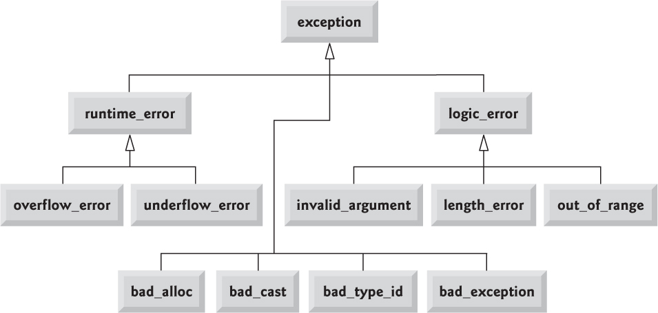
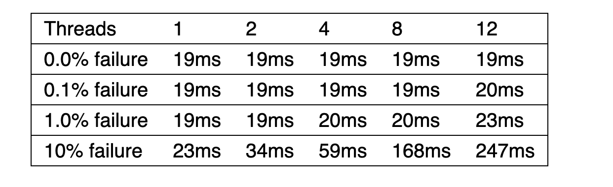

# Lecture 15. Error Handling

> Источник: [Google Slides](https://docs.google.com/presentation/d/1bXINre3KdxlpR7y4xLp6ecdY1Afrve-Xyje6W44NacY/edit)

## Язык С++


- Error Handling

## Ошибки


- Выход за границу массива
- Деление на ноль
- Невозможность выделить память
- Отсутствие прав на открытие файла
- Недоступность внешнего сервера
- ….

## Assert


```cpp
#include <cassert>

int main() {
    assert(2 + 2 == 4);
    assert(2 + 2 == 5);
    return 0;
}
```

- int main(): Assertion `2+2 == 5' failed.

## static_assert


```cpp
static_assert(sizeof(int) == 4, "int must be 4 bytes");

template <typename T>
struct data_structure {
```

- static_assert(
```cpp
std::is_default_constructible<T>::value,
```

- "Data Structure requires default-constructible elements"
```cpp
   );
   }
   ;
   struct no_default {
       no_default() = delete;
   };

   int main() {
       data_structure<no_default> ds_error;
       return 0;
   }
```

## Код возврата


- // количество успешно записанных
```cpp
size_t fwrite(const void* buffer, size_t size, size_t count, FILE* stream);
```

- // errno
```cpp
FILE* fopen(const char* filename, const char* mode);
```

- // ошибка в качестве кода возврата
```cpp
errno_t fopen_s(FILE* restrict* restrict streamptr, const char* restrict filename,
                const char* restrict mode);
```

- ERRNO

## Обработка в месте возврата


```cpp
int main() {
    FILE* file = fopen("test.tmp", "w");
    if (!file) {
```

- // do something
```cpp
}
if (fprintf(file, "Hello") < 0 || printf(file, "World") < 0) {
```

- // do something
```cpp
}
if (fclose(file) == EOF) {
```

- // do something
```cpp
}
return 0;
}
```

## Exception. throw + try + catch


```cpp
int foo() {
    throw std::runtime_error("error");
}

void boo() {
    throw 2;
}

void coo() {
    throw std::string("Hello world");
}

int main(int, char**) {
    try {
        foo();
    } catch (...) {
    }
}
```

## Stack unwinding


- Сконструированный объект пробрасывается обратно по стэку
- До встречи подходящего блока try\catch
- “Раскручивая” стэк обратно уничтожаются все объекты с automatic storage duration (!NB Если исключение не перехватывается, то stack unwinding зависит от реализации )
```cpp
std::terminate если в процессе возникает еще одно исключение
```

- Деструктор noexcept
- Сам объект хранится в неопределенном участке памяти

## Stack unwinding


```cpp
struct Foo {
    Foo() {
        std::cout << "Foo()\n";
    }
    ~Foo() {
        std::cout << "~Foo()\n";
    }
};

void internalFunc() {
    Foo f;
    throw std::runtime_error("Some error");
}

void externalFunc() {
    try {
        internalFunc();
    } catch (std::exception& e) {
        std::cout << e.what() << std::endl;
    }
}
```

## Exception


```cpp
int main() {
    try {
        foo();
    } catch (const std::overflow_error& e) {
```

- // do somethisg
```cpp
}
catch (const std::runtime_error& e) {
```

- // do somethisg
```cpp
}
catch (const std::exception& e) {
```

- // do somethisg
```cpp
}
catch (...) {
```

- // do somethisg
```cpp
}
```

## Гарантии безопасности исключений


- No guarantee
- Basic guarantee
- Сохраняется инвариант
- Нет утечек
- Strong guarantee
- Сохраняется инвариант
- Нет утечек
- Состояние возвращается к состоянию до исключения
- Nothrow guarantee
- Не может быть выкинуто исключение

## Exception guarantee


```cpp
struct Foo {
    int value;
```

- Foo(int v)
- : value(v)
```cpp
{
}
```

- Foo(const Foo& other)
- : value(other.value)
```cpp
{
    if (something) throw std::runtime_error("KEKW");
}
}
;
```

- Конструктор может кинуть исключение

## Exception guarantee


```cpp
class Boo {
   private:
    Foo* foo_ = nullptr;
    int value_ = 0;

   public:
    Boo(int value = 0) : value_(value) {}
```

- Boo(int value, int foo_value)
- : foo_(new Foo{foo_value})
- , value_(value)
```cpp
{
}

~Boo() {
    delete foo_;
}

friend std::ostream& operator<<(std::ostream& stream, const Boo& value);
}
;
```

## No guarantee


- Boo(const Boo& other)
- : value_(other.value_)
- , foo_(new Foo(*other.foo_))
```cpp
{
}

Boo& operator=(const Boo& other) {
    value_ = other.value_;
    delete foo_;
    foo_ = new Foo(*other.foo_);
    return *this;
}
```

- Возможно other.foo_ == nullptr

## No guarantee


```cpp
Boo& operator=(const Boo& other) {
    if (this == &other) return *this;

    value_ = other.value_;
    delete foo_;
    if (other.foo_) foo_ = new Foo(*other.foo_);
    return *this;
}
```

- После перехвата исключение в foo_ адрес который мы удалили

## Basic guarantee


```cpp
Boo& operator=(const Boo& other) {
    if (this == &other) return *this;

    value_ = other.value_;
    delete foo_;
    foo_ = nullptr;

    if (other.foo_) foo_ = new Foo(*other.foo_);

    return *this;
}
```

- Даже если конструктор бросит исключение Boo останется в инвариантном состоянии

## Basic guarantee


- Boo(const Boo& other)
- : value_(other.value_)
```cpp
{
    if (other.foo_) foo_ = std::make_unique<Foo>(*other.foo_);
}

Boo& operator=(const Boo& other) {
    if (this == &other) return *this;

    value_ = other.value_;
```

- foo_.release()
```cpp
if (other.foo_) foo_ = std::make_unique<Foo>(*other.foo_);

return *this;
}
```

- RAII

## Strong guarantee


```cpp
Boo& operator=(const Boo& other) {
    if (this == &other) return *this;

    Boo tmp(other);
    swap(tmp);

    return *this;
}
```

- void swap(Boo& other) noexcept {
```cpp
std::swap(value_, other.value_);
std::swap(foo_, other.foo_);
}
```

- swap не кидает исключение
- Исключение в конструкторе Boo не поменяет состояние this
- Copy And Swap Idiom

## Strong guarantee


```cpp
Boo& operator=(const Boo& other) {
    if (this == &other) return *this;

    Boo tmp(other);
    *this = std::move(tmp);

    return *this;
}

Boo& operator=(Boo&&) noexcept = default;
```

## noexcept


- Гарантирует что функция не будет бросать исключения
- Не сворачивает стэк
- Позволяет компилятору лучше оптимизировать код
```cpp
std::terminate
```

- Деструктор noexcept  по умолчанию

## std::exception


- Кидать стандартные типы в качестве исключений - малоинформативно
- Исключение должно нести информацию о случившемся событии
```cpp
std::exception - базовый класс для исключений стандартной библиотеки
```

- Тип эксепшена также является полезной информацией

## std::exception


```cpp
class exception {
   public:
    exception() noexcept;
    exception(const exception&) noexcept;
    exception& operator=(const exception&) noexcept;
    virtual ~exception();
    virtual const char* what() const noexcept;
};
```

## std::exception

<!-- embedded-images:start -->

<!-- embedded-images:end -->


## std::exception


```cpp
class my_exception : public std::exception {  // derived from std::exception
   public:
    my_exception(const std::string& what) : what_(what) {}
    const char* what() const noexcept override {
        return what_.c_str();
    }

   private:
    std::string what_;
};
```

## std::exception


```cpp
int foo() {
    throw my_exception("error");  // by rvalue
}

int main(int, char**) {
    try {
        foo();
    } catch (const my_exception& e) {  // by const reference
        std::cerr << e.what();
        std::runtime_error
    }
}
```

## Exception


- Исключения предназначены исключительно для обработки ошибок
- Обработки ошибок должна строиться вокруг инварианта объекта
- Исключения принято кидать по-значению, а ловить по-ссылку

## Exception cost

<!-- embedded-images:start -->

<!-- embedded-images:end -->


```cpp
struct invalid_value {};

void do_sqrt(std::span<double> values) {
    for (auto& v : values) {
        if (v < 0) throw invalid_value{};
        v = std::sqrt(v);
    }
}
```

- Proposal P2544R0

## std::expected


```cpp
enum class EDivError {
```

- DevisionByZero = 0,
```cpp
}
;

std::expected<int, EDivError> my_div(int a, int b) {
    if (b == 0) return std::unexpected{EDivError::DevisionByZero};

    return a / b;
}
```

## std::expected


```cpp
int main() {
    auto r = my_div(8, 0);
    if (r) std::cout << *r << std::endl;

    try {
        std::cout << r.value() << std::endl;
    } catch (std::bad_expected_access<EDivError>& err) {
        std::cout << err.what() << std::endl;
    }

    return 0;
}
```

## std::expected (C++ 23)


- Позволяет возвращать либо ожидаемое значение либо ошибку
- Накладные расходы сравнимы с кодом возврата
- Передает ответственность за обработку вызывающему коду
```cpp
std::expected<T, E> std::unexpected<E> std::bad_expected_access
```

## Исключения и код возврата


- Исключения позволяют обрабатывать ошибки единообразно, но не в месте возникновения
- Коды возврата позволяют обработать ошибку сразу при возникновении но не единообразно
```cpp
std::expected позволяет иметь комбинированный подход
```

## Исключения и код возврата


```cpp
uint32_t to_uint(std::string_view str) {
    uint32_t result = 0;
    for (char c : str) {
        result *= 10;
        result += c - '0';
    }

    return result;
}

int main(int, char**) {
    std::cout << to_uint("100500") << std::endl;
}
```

## Исключения и код возврата


```cpp
uint32_t to_uint(std::string_view str) {
    uint32_t result = 0;
    for (char c : str) {
        result *= 10;
        result += c - '0';
    }

    return result;
}

int main(int, char**) {
    std::cout << to_uint("abc") << std::endl;
    std::cout << to_uint("abc100500") << std::endl;
    std::cout << to_uint("100500abc") << std::endl;
}
```

- Требуется обрабатывать исключительные ситуации

## Исключения и код возврата


```cpp
uint32_t to_uint(std::string_view str) {
    uint32_t result = 0;

    if (str.empty()) return 0;

    for (char c : str) {
        if (c < '0' || c > '9') return result;
        result *= 10;
        result += c - '0';
    }

    return result;
}
```

- Не сообщает нам об ошибке
- Не решает проблему строк начинающихся с цифр
- Не решает проблему пустых строк

## Исключения и код возврата


```cpp
bool to_uint(std::string_view str, uint32_t& result) {
    if (str.empty()) return false;

    for (char c : str) {
        if (c < '0' || c > '9') 
```

- <stdlib.h>
```cpp
result *= 10;
result += c - '0';
}

return true;
}
```

- Лучше, но не отвечает на вопрос что случилось

## Исключения и код возврата


```cpp
uint32_t to_uint(std::string_view str) {
    uint32_t result = 0;
    if (str.empty()) {
        errno = EINVAL;
        return result;
    }

    for (char c : str) {
        if (c < '0' || c > '9') {
            errno = EDOM;
            return result;
        }
        result *= 10;
        result += c - '0';
    }

    return result;
}
```

- Решает проблему в стиле С
- через erron

## Исключения и код возврата


```cpp
uint32_t to_uint(std::string_view str) {
    uint32_t result = 0;
    if (str.empty()) throw std::invalid_argument("String is empty");

    for (char c : str) {
        if (c < '0' || c > '9')
            throw std::invalid_argument{std::format("Argument {} is not a number", str)};

        result *= 10;
        result += c - '0';
    }

    return result;
}
```

- Проброс исключения

## Исключения и код возврата


```cpp
std::optional<uint32_t> to_uint(std::string_view str) {
    if (str.empty()) return {};
    uint32_t result = 0;

    for (char c : str) {
        if (c < '0' || c > '9') return {};

        result *= 10;
        result += c - '0';
    }

    return result;
}
```

- Похож на вариант с bool, но бросит исключение если не проверить наличие результата

## Исключения и код возврата


```cpp
std::expected<uint32_t, std::invalid_argument> to_uint(std::string_view str) {
    if (str.empty()) return std::unexpected{std::invalid_argument("String is empty")};

    uint32_t result;

    for (char c : str) {
        if (c < '0' || c > '9')
            return std::unexpected{
                std::invalid_argument{std::format("Argument {} is not a number", str)}};

        result *= 10;
        result += c - '0';
    }

    return result;
}

Использует std::expected
```

