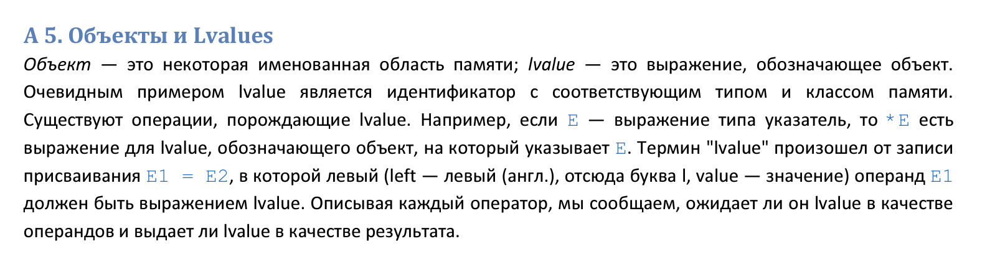
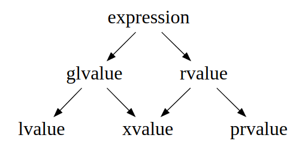

::: {.content-visible unless-format="revealjs"}

[Открыть слайды](slides/18-value-categories-move-semantics.html){.btn .btn-outline-primary target="_blank"}

> Источник: [Google Slides](https://docs.google.com/presentation/d/1e5ypC_v9q1hhPUMKDSabFFJB1arI4-yWHbs1hJTcJqo/edit)

:::

## Язык С++


- Value categories & Move Semantics

## Value categories

<!-- embedded-images:start -->

<!-- embedded-images:end -->


- Каждое выражение имеет тип и категорию

## Lvalue. Язык Си

<!-- embedded-images:start -->

<!-- embedded-images:end -->


- © Керниган и Ритчи. Язык Си

## Язык Си. lvalue & rvalue


```cpp
int main() {
    int i;
```

- i = 2024; // i - lvalue, 2024 - rvalue
- 2024 = i; // Compile-time error
```cpp
int arr[10];
```

- arr[1] = i;   // arr[1] - lvalue, i - lvalue
```cpp
return 0;
}
```

- Выражение относящееся к объекту, который занимает место в памяти
- rvalue - все что не lvalue. Не обязан иметь выделенное место
- При присваивании левый операнд всегда lvalue, правый lvalue или rvalue
- Не справедливо для современного С++

## lvalue & rvalue


- 'a';        // rvalue
- 128;        // rvalue
- 3.14f;      // rvalue
```cpp
int i = 1;  // lvalue
int j = 2;  // lvalue
```

- i + j;      // rvalue
- i + j = 2;  // Compile-time error
- &i;         // rvalue
```cpp
int* pi = &i;
```

- *pi;        // lvalue
```cpp
const int k = 1;  // lvalue
```

- k = 3;          // Compile-time error
- rvalue
- нельзя поменять
- нельзя получить адрес
- lvalue
- можно получить адрес
- менять можно но не всегда

## References and lvalue & rvalue


```cpp
int func(int i) {
    return i;
}

int main() {
    int x = 2;
    func(x);
    func(2);

    return 0;
}

int func(int& i) {
    return i;
}

int main() {
    int x = 2;
    func(x);
```

- func(2);  // Error
```cpp
return 0;
}

int func(const int& i) {
    return i;
}

int main() {
    int x = 2;
    func(x);
    func(2);

    return 0;
}
```

## Value categories

<!-- embedded-images:start -->

<!-- embedded-images:end -->


## Value Categories


- glvalue (generalized lvalue) - Выражение определяющие идентичность объекта или функции
- rvalue - prvalue или xvalue
- xvalue (expiring value) -  Объект,  значение которого может быть переиспользовано
- lvalue - glvalue, но не xvalue
- prvalue (pure rvalue) - Выражение вычисляющие временный объект

## Rvalue


```cpp
struct Foo {
    Foo() = default;
    Foo(int i) : value(i) {}
    int value = 0;
};

void func(const Foo& v) {}

int main() {
```

- func(Foo{}); // creating temprorary object
- func(2);     // creating temprorary object
- Foo{}.value; // creating temprorary object
```cpp
return 0;
}
```

- Rvalue
- prvalue - pure rvalue
- xrvalue - expiring rvalue

## Rvalue reference


- &&  - rvalue reference (& - lvalue reference)
- Позволяет передавать в функцию rvalue
- Продлевает жизнь временным объектам
- move constructor
- move assignment operator
- reference collapsing

## Rvalue reference


```cpp
int&& func(int&& i) {
    return i;
}

int main() {
    int&& i = 1;
    const int&& j = 2;

    std::cout << func(1);

    int x = 2;
    int&& rx = x;         // error
    const int&& crx = x;  // error
    return 0;
}
```

## Rvalue reference


```cpp
void foo(Foo&) {
    std::cout << "void foo(Foo& )\n";
}

void foo(const Foo&) {
    std::cout << "void foo(const Foo& )\n";
}

void foo(Foo&&) {
    std::cout << "void foo(Foo&& )\n";
}

int main(int, char**) {
    Foo f;
    const Foo cf;
    Foo&& rvf = Foo{};

    foo(f);
    foo(cf);
    foo(Foo{});
```

- foo(rvf);  // !!!
```cpp
}
```

## CArray


```cpp
class CArray {
   public:
    CArray() {
        ...
    }
    explicit CArray(size_t size) {
        ...
    }
    ~CArray(){...} CArray(const CArray& array){....} CArray& operator=(const CArray& array) {
        ...
    }

   protected:
    void swap(CArray& array) {};

   private:
    int8_t* data_ = nullptr;
    size_t size_ = 0;
};
```

## Проблема избыточного копирования


```cpp
int main() {
    CArray arr1{5};
    CArray arr2{};

    arr2 = arr1;
    arr2 = createArray();
    return 0;
}
```

## Move constructor & move assignment


- CArray(CArray&& array) noexcept
```cpp
       : size_(std::exchange(array.size_, 0))
       , data_(std::exchange(array.data_, nullptr))
   {
   }

       CArray& operator=(CArray&& array) noexcept {
           delete[] data_;
           size_ = std::exchange(array.size_, 0);
           data_ = std::exchange(array.data_, nullptr);

           return *this;
       }
```

## Move constructor & move assignment


- Передают все значения полей в текущий объект
- Оставляют копируемый объект в инвариантном но неопределенном состоянии
- Очищают ресурсы текущего объекта
- default\delete
- Правило 5
- Правило 0

## © Howard Hinnant

<!-- embedded-images:start -->

<!-- embedded-images:end -->


## Проблема избыточного копирования


```cpp
int main() {
    CArray arr1{5};
    CArray arr2{};
```

- arr2 = arr1;          // lvalue
- arr2 = createArray(); // prvalue
```cpp
arr2 = std::move(arr1);  // xvalue
return 0;
}
```

## std::move


```cpp
template <class T>
typename remove_reference<T>::type&& move(T&& t) noexcept {
    typedef typename remove_reference<T>::type U;
    return static_cast<U&&>(t);
}
```

- Кастит в rvalue

## Copy-And-Swap Idiom


```cpp
CArray& operator=(CArray array) {
    swap(array);
    return *this;
}
```

## std::swap


```cpp
template <class T>
void std::swap(T& x, T& y) {
    T tmp = move(x);
    x = move(y);
    y = move(tmp);
}
```

## Forwarding reference


```cpp
template <typename T>
void function(T&& value) {}

int main(int, char**) {
    Foo&& foo = Foo{};
    auto&& value = foo;
}
```

- Универсальная ссылка
- lvalue если инициализируется lvalue
- rvalue если инициализируется rvalue

## Reference collapsing


```cpp
int main(int, char**) {
    Foo f;

    function(f);
    function(Foo{});
}

Foo&&->Foo & Foo && &->Foo & Foo & &&->Foo & Foo && &&->Foo&&
```

## Perfect forwarding


```cpp
template <typename T, typename Arg>
std::unique_ptr<T> my_make_unique(Arg arg) {
    return std::unique_ptr<T>(new T(arg));
}

template <typename T, typename Arg>
std::unique_ptr<T> my_make_unique(Arg& arg) {
    return std::unique_ptr<T>(new T(arg));
}

int main(int, char**) {
    Foo f;
    my_make_unique<Foo>(f);
    my_make_unique<Foo>(Foo{});
}
```

## Perfect forwarding


```cpp
template <typename T, typename Arg>
std::unique_ptr<T> my_make_unique(Arg&& arg) {
    return std::unique_ptr<T>(new T(arg));  // !! lvalue
}

int main() {
    my_make_unique<Foo>(Foo{});
}
```

## std::forward


```cpp
template <typename T>
T&& forward(std::remove_reference_t<T>& t) c {
    return static_cast<T&&>(t);
}
```

- lvalue скастит к lvalue
- rvalue скастит к rvalue
```cpp
в отличии от std::move который делает это безусловно
```

## Perfect forwarding


```cpp
template <typename T, typename Arg>
std::unique_ptr<T> my_make_unique(Arg&& arg) {
    return std::unique_ptr<T>(new T(std::forward<Arg>(arg)));
}

int main() {
    my_make_unique<Foo>(Foo{});
}
```

## Perfect forwarding


```cpp
template <typename T, typename... Arg>
std::unique_ptr<T> my_make_unique(Arg&&... arg) {
    return std::unique_ptr<T>(new T(std::forward<Arg>(arg)...));
}
```

## Lvalue & rvalue reference


```cpp
void boo(Boo&) {}

void boo(const Boo&) {}

void boo(Boo&&) {}

void boo(const Boo&&) {}

template <typename T>
void boo(T&&) {}
```

## Copy elision


```cpp
struct Foo {
    Foo() {
        std::cout << "Foo()\n";
    }

    Foo(const Foo&) {
        std::cout << "Foo(const Foo&)\n";
    }

    Foo(Foo&&) {
        std::cout << "Foo(Foo&&)\n";
    }
};

Foo rvo() {  // return value optimization
    return Foo();
}

Foo nvro() {  // named return value optimization
    Foo result;

    return result;
}

Foo createFoo(int i) {
    Foo odd;
    Foo even;
    return i % 2 == 0 ? odd : even;
}
```
