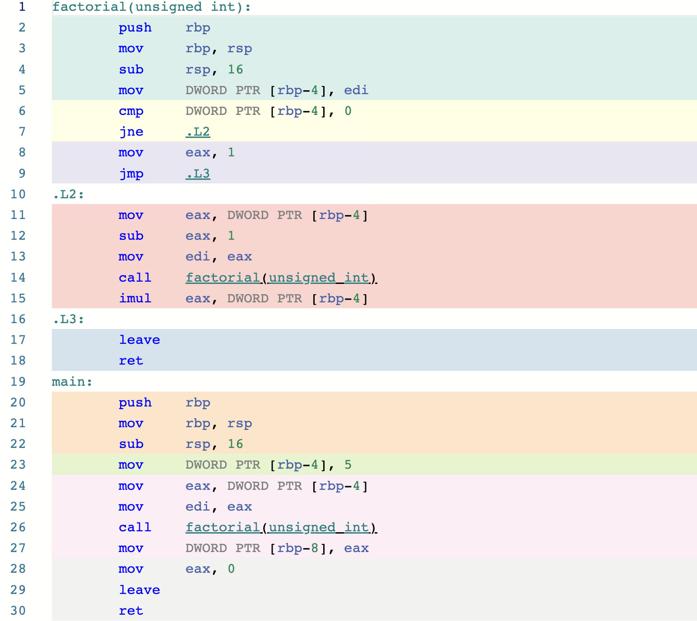
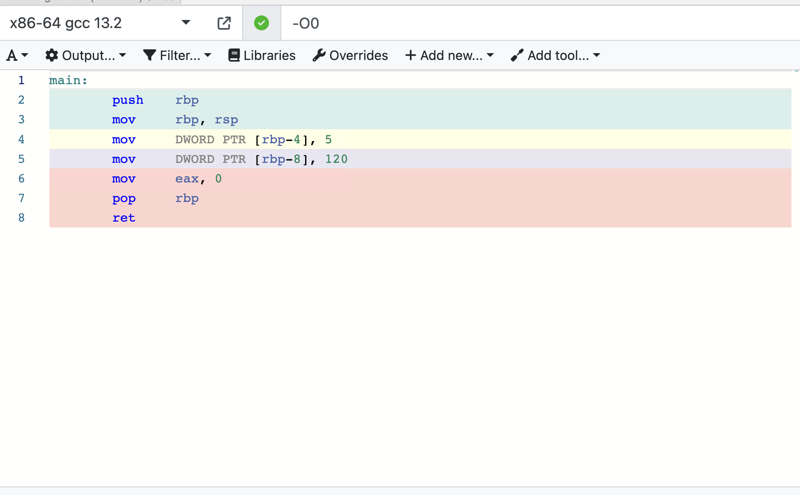

# Lecture 20.  Template Metaprogramming

> Источник: [Google Slides](https://docs.google.com/presentation/d/1pI7DRfTnDS_f5YLhoj6YMc7jwO4-C6jUcxNBxOMsZnE/edit)

## Язык С++


- Template Metaprogramming

## Compile-time evaluation


```cpp
template <unsigned N>
struct Factorial {
    enum { value = N * Factorial<N - 1>::value };
};

template <>
struct Factorial<0> {
    enum {
```

- value = 1
```cpp
}
;
}
;
```

## constexpr


- Позволяет переменной или функции быть вычисленной в compile-time
- constexpr variable
- Литеральный тип
- Инициализация через константное выражение (явно, constexpr функция и тд)
- constexpr function
- Возвращает литеральный тип
- Содержит переменные литеральных типов
- Не виртуальная
- Без исключений
- и тд

## constexpr

<!-- embedded-images:start -->

<!-- embedded-images:end -->


```cpp
unsigned factorial(unsigned n) {
    if (n == 0) return 1;

    return n * factorial(n - 1);
}

int main() {
    unsigned n = 5;
    unsigned x = factorial(n);
}
```

## constexpr

<!-- embedded-images:start -->

<!-- embedded-images:end -->


```cpp
constexpr unsigned factorial(unsigned n) {
    if (n == 0) return 1;

    return n * factorial(n - 1);
}

int main() {
    constexpr unsigned n = 5;
    constexpr unsigned x = factorial(n);
}
```

## Template Specialization


```cpp
template <typename T>
void print(T value) {
    std::cout << "Value = " << value << std::endl;
}

template <>
```

- void print<int>(int value) {
```cpp
std::cout << "Int value = " << value << std::endl;
}

int main() {
    print(1.2);
    print(2);
}
```

## Template Specialization


```cpp
template <typename T>
void print(T value) {
    std::cout << "Value = " << value << std::endl;
}

template <>
```

- void print<int>(int value) {
```cpp
std::cout << "Int value = " << value << std::endl;
}

template <typename T>
void print(T* value) {
    std::cout << "Value = " << *value << std::endl;
}

int main() {
    int i = 1;
    print(&i);
}
```

## Template Specialization


```cpp
template <typename T>
void print(T value) {
    std::cout << "Value = " << value << std::endl;
}

template <typename T>
void print(T* value) {
    std::cout << "Value = " << *value << std::endl;
}

template <>
void print(int* value) {
    std::cout << "Int Value = " << *value << std::endl;
}

int main() {
    int i = 1;
    print(&i);
}
```

## Template Specialization


```cpp
template <typename T>
void print(T value) {
    std::cout << "Value = " << value << std::endl;
}

template <>
void print(int* value) {
    std::cout << "Int Value = " << *value << std::endl;
}

template <typename T>
void print(T* value) {
    std::cout << "Value = " << *value << std::endl;
}

int main() {
    int i = 1;
    print(&i);
}
```

## Metaprogramming С++


- Программирование над программами (используем программу как данные)
- Compile-time for C++
- template

## is_same (naive)


```cpp
template <typename T, typename U>
struct is_same {
    static constexpr bool value = false;
};

template <typename T>
struct is_same<T, T> {
    static constexpr bool value = true;
};

int main() {
    static_assert(is_same<int, int>::value);
    static_assert(!is_same<int, float>::value);
    static_assert(!is_same<int, int&>::value);
    static_assert(!is_same<const int, int>::value);
}
```

## Metafunction (values)


```cpp
template <typename T>
T&& identity(T&& value) {
    return std::forward<T>(value);
}

int main() {
    int x = identity(239);
}

template <typename T, T Value>
struct value_identity {
    static constexpr T value = Value;
};

int main() {
    int x = value_identity<int, 239>::value;
}
```

## Metafunction (values)


```cpp
template <auto Value>
struct value_identity {
    static constexpr auto value = Value;
};

int main() {
    static_assert(value_identity<239>::value == 239);
}
```

## Metafunction (values)


```cpp
template <auto... Value>
struct sum {
    static constexpr auto value = (Value + ...);
};

int main() {
    static_assert(sum<1, 2, 3, 4, 5>::value == 15);
}
```

## Metafunction (types)


```cpp
namespace std {

template <class _Tp>
struct type_identity {
    typedef _Tp type;
};

}  // namespace std
```

## Metafunction (types)


```cpp
struct Boo {};

int main() {
```

- static_assert(
```cpp
std::is_same < std::type_identity<Boo>::type,
```

- Boo
```cpp
       >::value
   );
       }
```

## Helper variable\types


- Договоренности по именовании вспомогательных классов\переменных
- _t  - для типов
- _v – для переменных
```cpp
template <class T, class U>
constexpr bool is_same_v = is_same<T, U>::value;

template <typename T>
using type_identity_t = typename std::type_identity<T>::type;

int main() {
```

- static_assert(
```cpp
       std::is_same_v<std::type_identity_t<Boo>, Boo>
   );
       }
```

## std::true_type\std::false_type


```cpp
template <typename T, T Value>
struct integral_constant {
    static constexpr T value = Value;
    using value_type = T;
    using type = integral_constant;
```

- constexpr operator value_type() const noexcept { return value; }
- constexpr value_type operator()() const noexcept { return value; }
```cpp
}
;

template <bool B>
using bool_constant = integral_constant<bool, B>;

using true_type = integral_constant<bool, true>;
using false_type = integral_constant<bool, true>;
```

## std::true_type\std::false_type


```cpp
template <class T, class U>
struct is_same : std::false_type {};

template <class T>
struct is_same<T, T> : std::true_type {};
```

## <type_traits>


- Содержит набор метафункция для работы с типами
- <https://en.cppreference.com/w/cpp/header/type_traits>
- Primary type categories
- Composite type categories
- Type properties
- Supported operations
- Type relationships
- Const-volatility specifiers
- etc

## is_pointer (Primary type categories)


```cpp
template <class T>
struct is_pointer : std::false_type {};

template <class T>
struct is_pointer<T*> : std::true_type {};

template <class T>
struct is_pointer<T* const> : std::true_type {};

template <class T>
struct is_pointer<T* volatile> : std::true_type {};

template <class T>
struct is_pointer<T* const volatile> : std::true_type {};

template <typename T>
inline constexpr bool is_pointer_v = is_pointer<T>::value;
```

## std::remove_cv


```cpp
template <class T>
struct remove_const {
    using type = T
};

template <class T>
struct remove_const<const T> {
    using type = T
};

template <class T>
using remove_const_t = typename remove_const<T>::type;

template <typename T>
using remove_cv = remove_const<remove_volatile_t<T>>;

template <typename T>
using remove_cv_t = typename remove_cv<T>::type;
```

## std::is_pointer


```cpp
template <typename T>
struct is_pointer_impl : std::false_type {};

template <typename T>
struct is_pointer_impl<T*> : std::true_type {};

template <typename T>
struct is_pointer : is_pointer_impl<std::remove_cv_t<T>> {};

template <typename T>
inline constexpr bool is_pointer_v = is_pointer<T>::value;

int main() {
    static_assert(is_pointer_v<int const*>);
}
```

## Specialization Base on Traits


```cpp
namespace details {
template <typename T, bool>
struct PrintImpl {
    static void print(const T& value) {
        std::cout << "Value = " << value << std::endl;
    }
};

template <typename T>
struct PrintImpl<T, true> {
    static void print(const T& value) {
        std::cout << "Value = " << *value << std::endl;
    }
};
}  // namespace details

template <typename T>
void print(const T& value) {
    details::PrintImpl<T, std::is_pointer_v<T>>::print(value);
}
```

## Tag Dispatch Idiom


```cpp
namespace details {

template <typename T>
void print(std::false_type, const T& value) {
    std::cout << "Value = " << value << std::endl;
}

template <typename T>
void print(std::true_type, const T& value) {
    std::cout << "Value = " << *value << std::endl;
};
}  // namespace details

template <typename T>
void print(const T& value) {
    details::print(typename std::is_pointer<T>::type{}, value);
}
```

## SFINAE


- "Substitution Failure Is Not An Error"
- Если для перегрузки функции невозможно вывести параметры шаблона (type deduction) и инстанциировть функцию, то это не приводит к ошибки компиляции. Такая перегрузка опускается (ill-formed)
- SFINAE работает только с перегрузками функций
- SFINAE рассматривает только заголовки функция
- SFINAE отбрасывает только шаблонные функции
- За счета SFINAE можно создавить условия, когда перегузка будет отбрасываться (well-formed)

## SFINAE


```cpp
template <typename T>
void print(T value, ...) {
    std::cout << "No implementation\n";
}
template <typename T>
void print(T value, int i) {
    std::cout << "int value " << i << std::endl;
}

int main() {
    print(1, 1);
    print(1, "Hello world");
    print(1, 1, 3);
}
```

## SFINAE


```cpp
struct Boo {};

int main() {
    using IntBooMemberPtr = int Boo::*;
    // using IntBooMemberPtr = int int::*; // compile-time error
}
```

## SFINAE


```cpp
template <typename T>
void foo(int T::*) {
    std::cout << "void foo(T::*)\n";
}

template <typename T>
void foo(...) {
    std::cout << "void foo(...)\n";
}

int main() {
    foo<Boo>(nullptr);
    foo<int>(nullptr);
}
```

## SFINAE


```cpp
template <typename T>
std::true_type can_have_member_ptr(int T::*);

template <typename T>
std::false_type can_have_member_ptr(...);

int main() {
    static_assert(decltype(can_have_member_ptr<Boo>(nullptr)){});
    static_assert(!decltype(can_have_member_ptr<int>(nullptr)){});
}
```

## is_class (naive)


```cpp
template <typename T>
std::true_type check_class(int T::*);

template <typename T>
std::false_type check_class(...);

template <typename T>
struct is_class : decltype(check_class<T>(nullptr)) {};

template <typename T>
constexpr bool is_class_v = is_class<T>::value;

int main() {
    static_assert(is_class_v<Boo>);
    static_assert(!is_class_v<int>);
}
```

## std::enable_if (C++ 11)


```cpp
template <bool, class T = void>
struct enable_if {};

template <class T>
struct enable_if<true, T> {
    using type = T;
};

template <bool B, class T = void>
using enable_if_t = typename enable_if<B, T>::type;
```

## std::enable_if


```cpp
template <typename T>
void print(const T& value, std::enable_if_t<std::is_pointer_v<T>, void*> = nullptr) {
    std::cout << *value << std::endl;
}

template <typename T>
void print(const T& value, std::enable_if_t<!std::is_pointer_v<T>, void*> = nullptr) {
    std::cout << value << std::endl;
}

int main() {
    int i = 1;
    print(i);
    print(&i);
}
```

## if constexpr


```cpp
template <typename T>
void print(const T& value) {
    if constexpr (std::is_pointer_v<T>) {
        std::cout << "Value = " << *value << std::endl;
    } else {
        std::cout << "Value = " << value << std::endl;
    }
}
```

## Metaprogramming + variadic


```cpp
template <typename... T>
struct is_all_integral : conjunction<std::is_integral<T>...> {};

template <typename... T>
constexpr bool is_all_integral_v = is_all_integral<T...>::value;

int main() {
    static_assert(is_all_integral_v<int, long, char>);
}
```

## Metaprogramming + variadic


```cpp
template <typename...>
struct conjunction : std::true_type {};

template <typename T>
struct conjunction<T> : T {};

template <typename T, typename... TArgs>
struct conjunction<T, TArgs...> : conditional_t<!bool(T::value), T, conjunction<TArgs...>> {};
```

## Metaprogramming + variadic


```cpp
template <bool, typename T, typename U>
struct conditional {};

template <typename T, typename U>
struct conditional<true, T, U> {
    using type = T;
};

template <typename T, typename U>
struct conditional<false, T, U> {
    using type = U;
};

template <bool b, typename T, typename U>
using conditional_t = conditional<b, T, U>::type;
```

## Metaprogramming + variadic


```cpp
template <typename T, typename... TArgs>
struct is_one_of : std::disjunction<std::is_same<T, TArgs>...> {};

template <typenaуme T>
struct is_one_of<T> : std::false_type {};

int main() {
    static_assert(is_one_of<int, long, int>::value);
}
```

## void_t (C++17)


```cpp
template <class...>
using void_t = void;
```

- Корректен только если все параметры шаблона определимы
```cpp
Упрощает enable_if<>::type
```

## is_class (naive)


```cpp
template <typename T, typename = void>
struct is_class : std::false_type {};

template <typename T>
struct is_class<T, std::void_t<int T::*>> : std::true_type {};

template <typename T>
constexpr bool is_class_v = is_class<T>::value;

int main() {
    static_assert(is_class_v<Boo>);
    static_assert(!is_class_v<int>);
}
```

## Concepts (C++ 20)


- Позволяют задавать ограничения для шаблонных параметров функций и классов в compile-time
- Похожи на enable_if и  void_t, но имеют другую механику
- Более нативны с точки зрения использования
- concept
- requires (simple, type, compound, nested)

## requires


```cpp
template <typename T>
    requires std::is_pointer_v<T>
void print(const T& value) {
    std::cout << *value << std::endl;
}

template <typename T>
void print(const T& value) {
    std::cout << value << std::endl;
}
```

## Concepts


```cpp
template <typename T, typename U>
concept Addable = requires(T a, U b) { a + b; };

template <typename T, typename U>
```

- requires Addable<T,U>
```cpp
auto add(const T& a, const U& b) {
    return a + b;
}

int main() {
    add(1, 2);
    add(Foo{}, Foo{});
}
```

## Concepts


```cpp
template <typename T, typename U>
concept Addable = requires(T a, U b) { a + b; };

template <typename T, Addable<T> U>
auto add(const T& a, const U& b) {
    return a + b;
}

int main() {
    add(1, 2);
    add(Foo{}, Foo{});
}
```

## Concepts


```cpp
template <typename T, typename U>
concept Addable = requires(T a, U b) { a + b; };

template <typename T, typename U>
auto add(const T& a, const U& b)
    requires Addable<T, U>
{
    return a + b;
}

int main() {
    add(1, 2);
    add(Foo{}, Foo{});
}
```

## Concepts


```cpp
template <typename T, typename U>
concept Addable = requires(T a, U b) { a + b; };

auto add(auto a, Addable<decltype(a)> auto b) {
    return a + b;
}

int main() {
    add(1, 2);
    add(Foo{}, Foo{});
}
```

## requirements


- simple
- type
- compound
- nested

## simple requirements


```cpp
template <typename... Args>
concept Addable = requires(Args... args) {
```

- (args + ...);   // simple requirement
```cpp
}
;

template <typename... Args>
```

- requires Addable<Args...>
```cpp
auto add(Args&&... args) {
    return (args + ...);
}

int main() {
    add(Foo{}, Foo{});
    add(1, 2, 3, 4);
}
```

## nested requirements


```cpp
template <class T, typename... TArgs>
constexpr bool are_all_same = std::disjunction_v<std::is_same<T, TArgs>...>;

template <typename... Args>
concept Addable = requires(Args... args) {
```

- (args + ...);   // simple requirement
```cpp
requires sizeof...(Args) > 1;
requires are_all_same<Args...>;
}
;
```

## compound requirements


```cpp
template <typename... Ts>
using first_arg_t = first_arg<Ts...>::type;

template <typename... Args>
concept Addable = requires(Args... args) {
```

- (args + ...);   // simple requirement
```cpp
requires sizeof...(Args) > 1;
requires are_all_same<Args...>;
{
    (args + ...)
} noexcept -> std::same_as<first_arg_t<Args...>>;
}
;
```

## type requirements


```cpp
template <typename... Ts>
using first_arg_t = first_arg<Ts...>::type;

template <typename... Args>
concept Addable = requires(Args... args) {
```

- (args + ...);   // simple requirement
```cpp
requires sizeof...(Args) > 1;
requires are_all_same<Args...>;
{
    (args + ...)
} noexcept -> std::same_as<first_arg_t<Args...>>;
}
;
```

