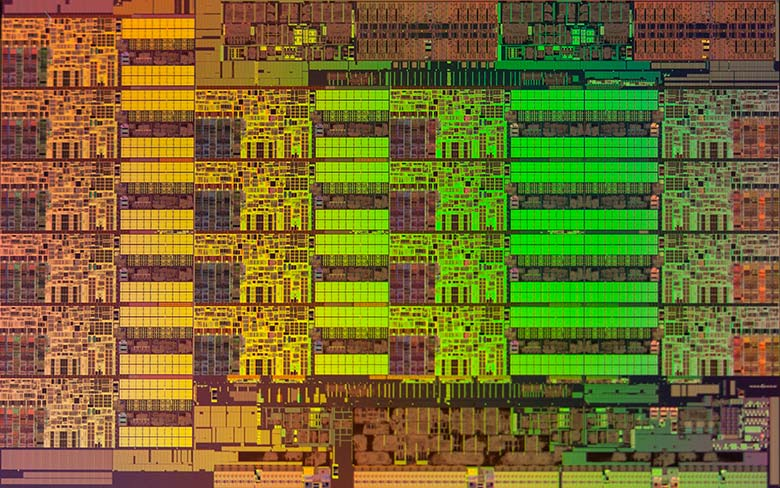
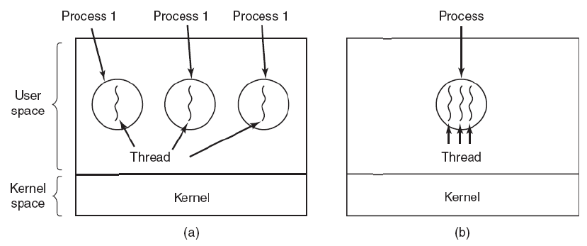
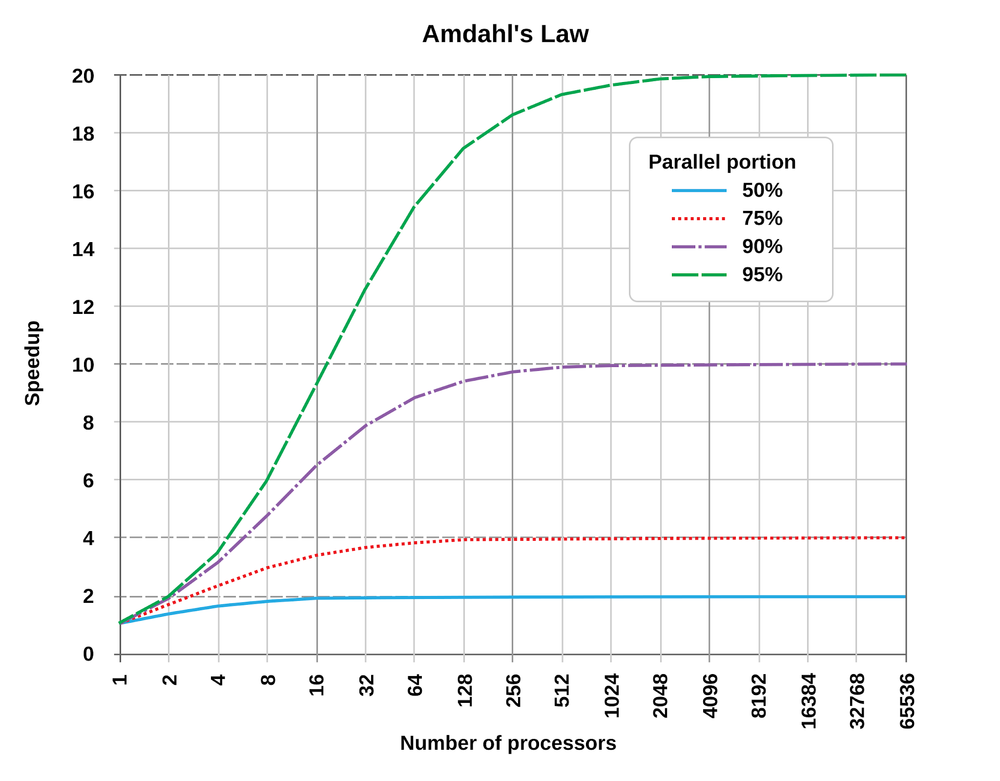
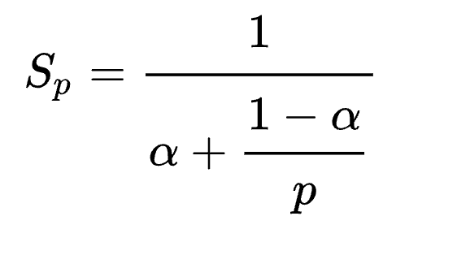

::: {.content-visible unless-format="revealjs"}

[Открыть слайды](slides/21-concurrency.html){.btn .btn-outline-primary target="_blank"}

> Источник: [Google Slides](https://docs.google.com/presentation/d/1Fc_-jBdbBDQFfX7lQNJSd-zDlk3r7P08mV5WQxWrDyE/edit)

:::

## Язык С++


- Introduction to Concurrency

## Закон Мура

<!-- embedded-images:start -->

<!-- embedded-images:end -->


## Xeon Haswell

<!-- embedded-images:start -->

<!-- embedded-images:end -->


## Последовательная программа


- Действие1
- Действие2
- Действие3
- Действие4
- Действие5
- Действие6

## Чисто параллельная программа


- Действие1
- Действие2
- Действие3
- Действие4
- Действие5
- Действие6

## Реальные параллельные программы


- Действие1
- Действие2
- Действие4
- Действие3
- Действие5
- Действие6

## Concurrency vs Parallelism

<!-- embedded-images:start -->

<!-- embedded-images:end -->


- Parallelism - физическое выполнение нескольких нескольких действий одновременно
- Concurrency - выполнение двух или более задач одновременно
- (с) Concurrency in Action

## Hello World


```cpp
#include <thread>
#include <iostream>

int main(int argc, char** argv) {
    std::thread tr([]() { std::cout << "Hello World" << std::endl; });
    tr.join();

    return 0;
}
```

## Processes vs Threads

<!-- embedded-images:start -->

<!-- embedded-images:end -->


## Processes vs Threads


- Каждый процесс содержит хотя бы один поток
- Потоки шарят между собой общие ресурсы процесс (памят, файловые дескрипторы  и тд)
- У потоков общее виртуальное адресное пространство

## std::thread


```cpp
int main(int argc, char** argv) {
    std::thread tr{[] { std::print("Hello from {0}\n", std::this_thread::get_id()); }};
    tr.join();

    return 0;
}
```

- Класс стандартной библиотеки для запуска потоков

## std::thread


```cpp
int main(int argc, char** argv) {
    using namespace std::chrono_literals;

    for (int i = 0; i < 8; ++i) {
        std::thread tr {
            [] {
           int i = 0;
           std::print(
```

- "Hello from {0}. i has address {1}\n",
```cpp
 std::this_thread::get_id(), (void*)std::addressof(i)
);
 }
 }
 ;
 tr.detach();
 }
 std::this_thread::sleep_for(1s);

 return 0;
 }
```

- Каждый поток имеет отдельный сегмент для стека

## std::thread


```cpp
void sequential() {
    size_t count = 1000'000'000ull;
    std::vector<int> values(count);

    std::generate(values.begin(), values.end(), []() { return rand() % 100; });
}
```

## std::thread


```cpp
void parallel() {
    size_t count = 1000'000'000ull;
    size_t threadCount = 4;
    size_t perThreadCount = count / threadCount;
    std::vector<int> values(count);
    std::vector<std::thread> threads;

    for (int i = 0; i < threadCount; ++i) {
        auto begin = values.begin() + i * perThreadCount;
        auto end = values.begin() + (i + 1) * perThreadCount;
       threads.emplace_back([&]()std::generate(begin, end, []() {
            return rand() % 100;});
    });
}

for (auto& tr : threads) tr.join();
}
```

## std::thread


```cpp
void execute(auto&& func) {
    const auto start = std::chrono::high_resolution_clock::now();

    func();

    const auto end = std::chrono::high_resolution_clock::now();
    const std::chrono::duration<double> diff = end - start;
    std::cout << "durration = " << diff << std::endl;
}

int main(int argc, char** argv) {
    execute(parallel);
    execute(sequential);

    return 0;
}
```

- Почему ускорение меньше чем в 2 раза

## Закон Амдала

<!-- embedded-images:start -->



<!-- embedded-images:end -->


## Race Condition


```cpp
void sequential(const std::vector<int>& data) {
    int result = 0;
    for (int i = 0; i < data.size(); ++i) result += data[i];

    std::cout << result << std::endl;
}
```

- Вопрос переполнения опускаем

## Race Condition


```cpp
void parallel(const std::vector<int>& data, size_t threadCount) {
    int result = 0;
    size_t perThreadCount = data.size() / threadCount;
    std::vector<std::thread> threads;

    for (int t = 0; t < threadCount; ++t) {
        threads.emplace_back(
            [&](int thread) {
                for (int i = thread * perThreadCount; i < (thread + 1) * perThreadCount; ++i)
                    result += data[i];
            },
            t);
    }

    for (auto& tr : threads) tr.join();

    std::cout << result << std::endl;
}
```

- Получаем разные результаты от запуска к запуску
- result += data[i]
- эквивалентно
- result = result + data[i]

## Примитивы синхронизации


```cpp
std::mutex std::condition_variables
```

- semaphores
- atomic<>

## std::mutex


- позволяет защитить часть данных от одновременного обращение из разных потоков
- lock
- try_lock
- unlock

## Race Condition


```cpp
std::mutex mutex;

for (int t = 0; t < threadCount; ++t) {
    threads.emplace_back(
        [&](int thread) {
            int localResult = 0;
            for (int i = thread * perThreadCount; i < (thread + 1) * perThreadCount; ++i)
                localResult += data[i];

            mutex.lock();
            result += localResult;
            mutex.unlock();
        },
        t);
}
```

- Mutex обеспечивает последовательность выполнения

## Race Condition


```cpp
std::mutex mutex;

for (int t = 0; t < threadCount; ++t) {
    threads.emplace_back(
        [&](int thread) {
            int localResult = 0;
            for (int i = thread * perThreadCount; i < (thread + 1) * perThreadCount; ++i)
                localResult += data[i];

            std::lock_guard<std::mutex> lock{mutex};
            result += localResult;
        },
        t);
}
```

- lock_guard - RAII обертка для мьютекса

## std::atomic


- низкоуровневые инструкции процессор
- хорошо подходит для простых операций (add, store,exchange)
- не подходит для сложных синхронизаций
- имеет полные и частичные специализации

## std::atomic


```cpp
std::atomic<int> result = 0;

for (int t = 0; t < threadCount; ++t) {
    threads.emplace_back(
        [&](int thread) {
            int localResult = 0;
            for (int i = thread * perThreadCount; i < (thread + 1) * perThreadCount; ++i)
                localResult += data[i];

            result.fetch_add(localResult, std::memory_order_relaxed);
        },
        t);
}
```

## Ошибки многопоточного программирования


- Race Condition
- Ошибка проектирования многопоточной системы или приложения, при которой работа системы или приложения зависит от того, в каком порядке выполняются части кода.
- DeadLock
- Ситуация в многозадачной среде, при которой несколько процессов находятся в состоянии бесконечного ожидания ресурсов, занятых самими этими процессами.
- LiveLock
- Ситуация в которой система не «застревает» (как в обычной взаимной блокировке), а занимается бесполезной работой, её состояние постоянно меняется — но, тем не менее, она «зациклилась», не производит никакой полезной работы.

## DeadLock

<!-- embedded-images:start -->

<!-- embedded-images:end -->


## Проблема обедающих Философов

<!-- embedded-images:start -->

<!-- embedded-images:end -->


## Thread Pool (I)


```cpp
class ThreadPool {
    using TTask = std::function<void()>;

   public:
    ThreadPool(size_t threadCount) {
        for (int i = 0; i < threadCount; ++i) {
```

- threads_.emplace_back([this] {
```cpp
while (true) {
    TTask task;
    {
        std::unique_lock<std::mutex> lock(mutex_);
        condition_.wait(lock, [this] { return !tasks_.empty() || stop_; });

        if (stop_) return;

        task = std::move(tasks_.front());
        tasks_.pop();
    }

    task();
}
});
}
}

~ThreadPool() {
    Stop();
}

ThreadPool(const ThreadPool&) = delete;
ThreadPool& operator=(const ThreadPool&) = delete;

template <typename TFunc, typename... TArgs>
void addTask(TFunc&& func, TArgs&&... args) {
    {
        TTask task = [func = std::forward<TFunc>(func), ... args = std::forward<TArgs>(args)]() {
            std::invoke(func, args...);
        };
        std::unique_lock<std::mutex> lock(mutex_);
        tasks_.push(std::move(task));
    }

    condition_.notify_one();
}

void Stop() {
    {
        std::unique_lock<std::mutex> lock(mutex_);
        stop_ = true;
    }

    condition_.notify_all();
```

- // Дождаться завершения всех потоков
```cpp
for (auto& thread : threads_) {
    if (thread.joinable()) {
        thread.join();
    }
}
}
;

private:
std::vector<std::thread> threads_;
std::queue<TTask> tasks_;
mutable std::mutex mutex_;
std::condition_variable condition_;

bool stop_ = false;
}
;
```

## Thread Pool (I)


```cpp
class ThreadPool {
    using TTask = std::function<void()>;

   public:
    ThreadPool(size_t threadCount) {}

    ThreadPool(const ThreadPool&) = delete;
    ThreadPool& operator=(const ThreadPool&) = delete;

    template <typename TFunc, typename... TArgs>
    void addTask(TFunc&& func, TArgs&&... args) {}
};
```

## Thread Pool (I)


```cpp
int main() {
    ThreadPool pool{2};
    auto f = [](int n, int id) {
        auto thread_id = std::this_thread::get_id();
        for (int i = 0; i < n; ++i) {
            std::println("Thread id {}, Task Id {}, value : {}", thread_id, id, i);
            std::this_thread::sleep_for(1s);
        }
    };
    for (int i = 0; i < 4; ++i) pool.addTask(f, 5, i);

    return 0;
}
```

## Thread Pool (I)


```cpp
template <typename TFunc, typename... TArgs>
void addTask(TFunc&& func, TArgs&&... args) {
    std::invoke(std::forward<TFunc>(func), std::forward<TArgs>(args)...);
}
```

- Синхронный вызов

## Thread Pool (I)


```cpp
class ThreadPool {
    using TTask = std::function<void()>;

   public:
    template <typename TFunc, typename... TArgs>
    void addTask(TFunc&& func, TArgs&&... args) {
        TTask task = [func = std::forward<TFunc>(func), ... args = std::forward<TArgs>(args)]() {
            std::invoke(func, args...);
        };

        tasks_.push(std::move(task));
    }

   private:
    std::queue<TTask> tasks_;
```

## Thread Pool (I)


```cpp
ThreadPool(size_t threadCount) {
    for (int i = 0; i < threadCount; ++i) {
```

- threads_.emplace_back([this] {
```cpp
while (true) {
    std::this_thread::sleep_for(1s);
    TTask task;
    {
        std::lock_guard lock(mutex_);
        if (tasks_.empty()) continue;
        task = std::move(tasks_.front());
        tasks_.pop();
    }
    task();
}
});
}
}
```

- Потоки постоянно просыпаются и пытаются получить задание

## Thread Pool (I)


```cpp
class ThreadPool {
    using TTask = std::function<void()>;

   public:
    template <typename TFunc, typename... TArgs>
    void addTask(TFunc&& func, TArgs&&... args) {
        TTask task = [func = std::forward<TFunc>(func), ... args = std::forward<TArgs>(args)]() {
            std::invoke(func, args...);
        };
        std::lock_guard<std::mutex> lock(mutex_);
        tasks_.push(std::move(task));
    }

   private:
    std::queue<TTask> tasks_;
```

- Поля класс - места потенциальных гонок

## Thread Pool (I)


```cpp
~ThreadPool() {
    {
        std::lock_guard<std::mutex> lock(mutex_);
        stop_ = true;
    }

    for (auto& thread : threads_) {
        if (thread.joinable()) thread.join();
    }
};

private:
bool stop_ = false;
```

## std::condition_variable


- notify_one / notify_all
- wait / wait_until / wait_for
```cpp
std::unique_lock
```

## Thread Pool (I)


```cpp
TTask task;
{
    std::unique_lock<std::mutex> lock(mutex_);
    condition_.wait(lock, [this] { return !tasks_.empty() || stop_; });

    if (stop_) return;

    task = std::move(tasks_.front());
    tasks_.pop();
}

task();
```

## Thread Pool (I)


```cpp
template <typename TFunc, typename... TArgs>
void addTask(TFunc&& func, TArgs&&... args) {
    {
        TTask task = [func = std::forward<TFunc>(func), ... args = std::forward<TArgs>(args)]() {
            std::invoke(func, args...);
        };
        std::unique_lock<std::mutex> lock(mutex_);
        tasks_.push(std::move(task));
    }

    condition_.notify_one();
}
```

## Thread Pool (I)


```cpp
void Stop() {
    {
        std::unique_lock<std::mutex> lock(mutex_);
        stop_ = true;
    }

    condition_.notify_all();

    for (auto& thread : threads_) {
        if (thread.joinable()) {
            thread.join();
        }
    }
};
```

## std::future and std::promise


```cpp
int main() {
    std::cout << std::this_thread::get_id() << std::endl;
    std::promise<int> workPromise;
    std::future<int> workFuture = workPromise.get_future();
    std::thread work{[](std::promise<int> p) {
                         std::cout << std::this_thread::get_id() << std::endl;
                         int result = 1 + 2 + 3 + 4 + 5;
                         std::this_thread::sleep_for(3s);
                         p.set_value(result);
                     },
                     std::move(workPromise)};
    std::thread print{[](std::future<int> f) {
                          std::cout << std::this_thread::get_id() << std::endl;

                          int result = f.get();
                          std::cout << result << std::endl;
                      },
                      std::move(workFuture)};

    work.join();
    print.join();
    return 0;
}
```
